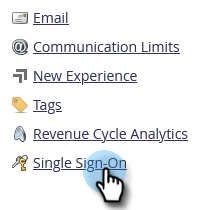

# Eén aanmelding toevoegen aan een portal {#add-single-sign-on-to-a-portal}

Als u een directoryservice hebt waarmee gebruikers worden geverifieerd, kunt u SSO (Single Sign-On) in Marketo toestaan. We ondersteunen deze functie met [!DNL Security Assertion Markup Language] (SAML) versie 2.0 en hoger.

Marketo functioneert als SAML Service Provider (SP) en is afhankelijk van een externe identiteitsprovider (IdP) om gebruikers te verifiëren.

Zodra SSO wordt toegelaten, kan IdP de geloofsbrieven van een gebruiker bevestigen. Wanneer een gebruiker de software van Marketo wenst te gebruiken, verzendt IdP dan een ondertekend bericht van SAML naar Marketo, handelend als SP. Dit bericht vouwt aan Marketo dat de gebruiker wordt gemachtigd om de software van Marketo te gebruiken.

>[!NOTE]
>
>**Beheerdersmachtigingen vereist**

>[!IMPORTANT]
>
>Dit is niet van toepassing op abonnementen op Adobe Identity. Voor abonnementen op Adobe Identity, wordt Single Sign On opstelling op het niveau van de Adobe of van de  in Adobe Admin Console. [Meer informatie hier](https://helpx.adobe.com/enterprise/using/set-up-identity.html){target="_blank"}.

>[!NOTE]
>
>Ben je [!DNL Microsoft Azure] gebruiker? Bekijk hun [integratiezelfstudie](https://azure.microsoft.com/en-us/documentation/articles/active-directory-saas-marketo-tutorial/){target="_blank"}.
FYI, er is een typefout in Stap 5c van hun zelfstudie. Gebruik `https://<munchkinid>.mktoweb.com`, _niet_ `https://<munchkinid>.marketo.com`.

## Hoe te om het Verzoek te verzenden {#how-to-send-the-request}

* Verzend het SSO- verzoek, dat een reactie van SAML is, naar `https://login.marketo.com/saml/assertion/<your-munchkin-id>`
* Als Publiek URL van SP. Gebruiken `http://saml.marketo.com/sp`
* Als u het SPNameQualifier attribuut gebruikt, plaats het element NameID voor Onderwerp aan `http://saml.marketo.com/sp`
* Als u meerdere Marketo-abonnementen aan dezelfde SSO-provider koppelt, kunt u unieke SP-URL&#39;s gebruiken voor elke Marketo-sub met de indeling `http://saml.marketo.com/sp/<munchkin_id>`

>[!NOTE]
>
>Marketo ondersteunt alleen door Identity Provider geïnitieerde (ook wel IdP-geïnitieerd genoemd), waarbij de gebruiker eerst de aanmeldingspagina IDP start, verifieert en vervolgens naar My Marketo navigeert.

## Aanvullende opmerkingen {#additional-notes}

* **Synchronisatietijd** - Voor een nieuwe gebruiker is er ongeveer een vertraging van 10 minuten voordat een eerste SSO-aanvraag wordt verwerkt.
* **Gebruikersinrichting** - Gebruikers worden handmatig geleverd door Marketo.
* **Toestemming** - Gebruikersmachtigingen blijven behouden in Marketo.
* **OAuth-ondersteuning** - Marketo ondersteunt momenteel geen OAuth.
* **Automatische doorgave van gebruikers** - Wordt ook wel &#39;Just in Time Provisioning&#39; genoemd. Dit is wanneer de eerste SAML-aanmelding van een gebruiker in staat is de gebruiker te maken in elke webtoepassing waartoe hij of zij toegang heeft (bijvoorbeeld Marketo) en er geen handmatige beheeractie is vereist. Dit wordt momenteel niet ondersteund door Marketo.
* **Versleuteling** - Marketo biedt momenteel geen ondersteuning voor codering.

>[!NOTE]
>
>Voordat u begint, moet u het certificaat van identiteitsprovider in de indeling X.509 en de extensie .crt, .der of .cer hebben.

## SAML-instellingen bijwerken {#update-saml-settings}

SSO is standaard uitgeschakeld. Volg deze stappen om SAML toe te laten en het te vormen.

1. Ga naar de **[!UICONTROL Admin]** gebied.

   

1. Klik op **[!UICONTROL Single Sign-On]**.

   

   >[!NOTE]
   >
   >Als u het niet ziet **[!UICONTROL Single Sign-On]** krachtens **[!UICONTROL Admin]**, contact [Marketo-ondersteuning](https://nation.marketo.com/t5/Support/ct-p/Support){target="_blank"}.

1. Onder de **[!UICONTROL SAML Settings]** sectie, klikken **[!UICONTROL Edit]**.

   

1. Wijzigen **[!UICONTROL SAML Single Sign-On]** tot **[!UICONTROL Enabled]**.

   

1. Voer uw **[!UICONTROL Issuer ID]**, **[!UICONTROL Entity ID]**, selecteert u de **[!UICONTROL User ID Location]** en klik vervolgens op **[!UICONTROL Browse]**.

   

1. Selecteer uw **[!UICONTROL Identity Provider Certificate]** bestand.

   

1. Klik op **[!UICONTROL Save]**.

   

## Instellingen voor omleiding van pagina bijwerken {#update-redirect-page-settings}

1. Onder de **[!UICONTROL Redirect Pages]** sectie, klikken **[!UICONTROL Edit]**.

   

   >[!NOTE]
   >
   >Klanten die gebruikmaken van een universele id in combinatie met een SSO, moeten de aanmeldings-URL van de identiteitsprovider invoeren in het dialoogvenster **[!UICONTROL Login URL]** veld.

1. Voer een **[!UICONTROL Logout URL]**. Dit is de URL waarnaar de gebruiker moet worden geleid wanneer deze zich afmeldt bij Marketo.

   

1. Voer een **[!UICONTROL Error URL]**. Dit is de URL waarnaar de gebruiker moet worden geleid voor het geval dat het aanmelden bij Marketo mislukt. Klik op **[!UICONTROL Save]**.

   

   >[!NOTE]
   >
   >Beide pagina&#39;s moeten openbaar zijn.

>[!MORELIKETHIS]
>
>* [Een universele id gebruiken voor aanmelding bij een abonnement](/help/marketo/product-docs/administration/settings/using-a-universal-id-for-subscription-login.md){target="_blank"}
>* [Alleen gebruikersaanmelding beperken tot SSO](/help/marketo/product-docs/administration/additional-integrations/restrict-user-login-to-sso-only.md){target="_blank"}
>* [Marketo-gebruikers uitnodigen voor twee instanties met Universal ID](https://nation.marketo.com/t5/Knowledgebase/Inviting-Marketo-Users-to-Two-Instances-with-Universal-ID-UID/ta-p/251122){target="_blank"}
