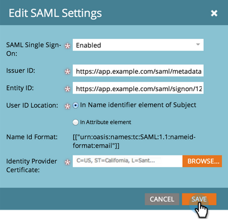
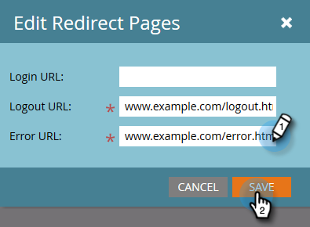

# Eén aanmelding toevoegen aan een portal {#add-single-sign-on-to-a-portal}

Als u een directoryservice hebt waarmee gebruikers worden geverifieerd, kunt u SSO (Single Sign-On) in Marketo toestaan. Deze functie wordt ondersteund met [!DNL Security Assertion Markup Language] (SAML) versie 2.0 en hoger.

Marketo functioneert als SAML Service Provider (SP) en is afhankelijk van een externe identiteitsprovider (IdP) om gebruikers te verifiëren.

Zodra SSO wordt toegelaten, kan IdP de geloofsbrieven van een gebruiker bevestigen. Wanneer een gebruiker de software van Marketo wenst te gebruiken, verzendt IdP dan een ondertekend bericht van SAML naar Marketo, handelend als SP. Dit bericht vouwt aan Marketo dat de gebruiker wordt gemachtigd om de software van Marketo te gebruiken.

>[!NOTE]
>
>**Vereiste Bevoegdheden Admin**

>[!IMPORTANT]
>
>Dit geldt niet voor abonnementen op Adobe Identity. Voor abonnementen op Adobe Identity wordt Single Sign On ingesteld op Adobe Org-niveau in Adobe Admin Console. Adobe Admin Console ondersteunt momenteel alleen SP-gestarte bestanden. [ leer hier meer ](https://helpx.adobe.com/nl/enterprise/using/set-up-identity.html){target="_blank"}.

>[!NOTE]
>
>Bent u een [!DNL Microsoft Azure] gebruiker? Controle uit hun [ integratieleerprogramma ](https://learn.microsoft.com/en-us/entra/identity/saas-apps/marketo-tutorial){target="_blank"}. FYI, er is een typefout in Stap 5c van hun zelfstudie. Gelieve te plaatsen de Staat van het Relais aan `https://<munchkinid>.mktoweb.com`, **_niet_** `https://<munchkinid>.marketo.com`.

## Hoe te om het Verzoek te verzenden {#how-to-send-the-request}

* Verzend het SSO-verzoek, dat een SAML-reactie is, naar `https://login.marketo.com/saml/assertion/<your-munchkin-id>`
* Als Publiek URL van SP. `http://saml.marketo.com/sp` gebruiken
* Als u het SPNameQualifier attribuut gebruikt, plaats het element NameID voor Onderwerp aan `http://saml.marketo.com/sp`
* Als u meerdere Marketo-abonnementen aan dezelfde SSO-provider koppelt, kunt u unieke SP-URL&#39;s voor elke Marketo-sub gebruiken met de indeling `http://saml.marketo.com/sp/<munchkin_id>`

>[!NOTE]
>
>Marketo ondersteunt alleen Identiteitsprovider-gestarte (ook wel IdP-gestarte genoemd), waarin de gebruiker eerst de aanmeldingspagina IdP start, verifieert en vervolgens naar Mijn Marketo navigeert. Als uw Marketo-abonnement naar de beheerconsole is verplaatst, biedt Adobe Admin Console momenteel alleen ondersteuning voor door de serviceleverancier geïnitieerde services (ook wel SP-geïnitieerd genoemd). Er kunnen wijzigingen worden aangebracht in uw SSO-ervaring.

## Aanvullende opmerkingen {#additional-notes}

* **synchronisatie-up tijd** - voor een nieuwe gebruiker, is er ongeveer een minieme vertraging 10 alvorens een eerste SSO- verzoek wordt verwerkt.
* **Levering van de Gebruiker** - de gebruikers worden provisioned manueel door Marketo.
* **Vergunning** - de toestemmingen van de Gebruiker worden gehandhaafd binnen Marketo.
* **OAuth steun** - Marketo steunt momenteel geen OAuth.
* **Automatische die de Verspreiding van de Gebruiker** - ook als &quot;enkel in de Levering van de Tijd wordt bekend,&quot;dit is wanneer eerste login van SAML van een gebruiker in staat is om de gebruiker in om het even welke Webtoepassing tot stand te brengen zij toegang hebben (b.v., Marketo) en geen handadmin actie wordt vereist. Dit wordt momenteel niet ondersteund door Marketo.
* **Encryptie** - Marketo steunt momenteel geen encryptie.

>[!NOTE]
>
>Voordat u begint, moet u het certificaat van identiteitsprovider in de indeling X.509 en de extensie .crt, .der of .cer hebben.

## SAML-instellingen bijwerken {#update-saml-settings}

SSO is standaard uitgeschakeld. Volg deze stappen om SAML toe te laten en het te vormen.

1. Ga naar het **[!UICONTROL Admin]** -gebied.

   

1. Klik op **[!UICONTROL Single Sign-On]**.

   

   >[!NOTE]
   >
   >Als u niet **[!UICONTROL Single Sign-On]** onder **[!UICONTROL Admin]** ziet, contacteer [ de Steun van Marketo ](https://nation.marketo.com/t5/Support/ct-p/Support){target="_blank"}.

1. Klik onder de sectie **[!UICONTROL SAML Settings]** op **[!UICONTROL Edit]** .

   

1. Wijzig **[!UICONTROL SAML Single Sign-On]** in **[!UICONTROL Enabled]** .

   

1. Voer uw **[!UICONTROL Issuer ID]**, **[!UICONTROL Entity ID]** in, selecteer **[!UICONTROL User ID Location]** en klik op **[!UICONTROL Browse]** .

   

1. Selecteer het **[!UICONTROL Identity Provider Certificate]** -bestand.

   

1. Klik op **[!UICONTROL Save]**.

   

## Instellingen voor omleiding van pagina bijwerken {#update-redirect-page-settings}

1. Klik onder de sectie **[!UICONTROL Redirect Pages]** op **[!UICONTROL Edit]** .

   

   >[!NOTE]
   >
   >Klanten die gebruikmaken van de Universal ID en de SSO moeten de aanmeldings-URL van de Identiteitsprovider invoeren in het veld **[!UICONTROL Login URL]** .

1. Voer een **[!UICONTROL Logout URL]** in. Dit is de URL waarnaar de gebruiker moet worden geleid wanneer deze zich afmeldt bij Marketo.

   

1. Voer een **[!UICONTROL Error URL]** in. Dit is de URL waarnaar de gebruiker moet worden geleid voor het geval dat het aanmelden bij Marketo mislukt. Klik op **[!UICONTROL Save]**.

   

   >[!NOTE]
   >
   >Beide pagina&#39;s moeten openbaar zijn.

>[!MORELIKETHIS]
>
>* [ Gebruikend een Universele identiteitskaart voor de Login van het Abonnement ](/help/marketo/product-docs/administration/settings/using-a-universal-id-for-subscription-login.md){target="_blank"}
>* [ Beperk het Login van de Gebruiker tot SSO slechts ](/help/marketo/product-docs/administration/additional-integrations/restrict-user-login-to-sso-only.md){target="_blank"}
>* [ het Uitnodigen van de Gebruikers van Marketo aan Twee Instanties met Universele identiteitskaart ](https://nation.marketo.com/t5/Knowledgebase/Inviting-Marketo-Users-to-Two-Instances-with-Universal-ID-UID/ta-p/251122){target="_blank"}
