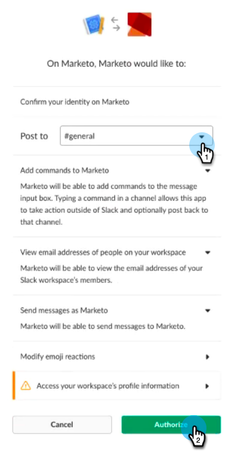

# Slack toevoegen als een LaunchPoint-service {#add-slack-as-a-launchpoint-service}

De Slack-integratie bevat twee meldingstypen:

* **Systeemmeldingen**: Krijg Slack berichten betreffende belangrijke gebeurtenissen in uw instantie van Marketo, zoals alarm over huidige campagnestatus en om het even welke kwesties die directe aandacht vereisen (de fouten van CRM en API grenzen).
* **Interesserende momenten**: Wanneer een bekende persoon een Marketo Insight heeft geactiveerd via een verkoopaccount, kunnen de hoofdeigenaars via Slack op de hoogte worden gesteld. Meldingen bevatten informatie over leads en informatie over de verkoopaccount.

>[!NOTE]
>
>**Beheerdersmachtigingen vereist**

>[!PREREQUISITES]
>
>Neem contact op met [Marketo-ondersteuning](https://nation.marketo.com/t5/Support/ct-p/Support) als u nog geen Slack-systeemmeldingen hebt ingeschakeld.

1. Ga naar **LaunchPoint**, dan onder **New** klik **New Service**.

   

1. Voer een weergavenaam in voor de Slack-integratie. Selecteer **Slack** in de vervolgkeuzelijst **Service**. Klik **Maken**.

   

1. Klik **Autoriseren**. Dit opent Slack op een nieuw lusje, waar u de vergunning zult voltooien en Marketo toestemming verleent om informatie van Slack te trekken.

   

1. Voer op het nieuwe tabblad Slack de URL van uw werkruimte in en klik op **Doorgaan**.

   

1. Ga uw geloofsbrieven van de Slack in en klik **Teken binnen**.

   

1. Selecteer in de vervolgkeuzelijst **Plaatsen naar** het kanaal waar u berichten van Marketo wilt plaatsen. Controleer de gevraagde toestemmingen, dan klik **Autoriseren**.

   

1. U moet het bevestigingsscherm hieronder zien. De tab wordt automatisch gesloten.

   

1. Vernieuw het lusje van Marketo en bevestig dat Slack nu als actieve dienst in LaunchPoint vermeld is.

   

   Meldingen worden nu gepost naar het kanaal dat u in stap 6 hebt geselecteerd. Ze zullen er ongeveer zo uitzien:

   
