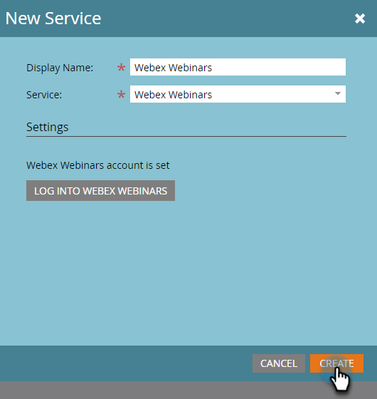

# [!DNL Webex] toevoegen als een [!DNL LaunchPoint] -service {#add-webex-as-a-launchpoint-service}

Marketo Engage beheert uw [!DNL Webex] webinar-registratie en -aanwezigheid. U moet een bestaand abonnement op [[!UICONTROL Webex] hebben &#x200B;](https://www.webex.com/).

>[!NOTE]
>
>**Vereiste Bevoegdheden Admin**

1. Ga naar het **[!UICONTROL Admin]** -gebied.

   

1. Klik op **[!UICONTROL LaunchPoint]**.

   

1. Selecteer **[!UICONTROL New]** en vervolgens **[!UICONTROL New Service]** .

   

1. Voer een **[!UICONTROL Display Name]** in. Selecteer **[!UICONTROL Service]** in de vervolgkeuzelijst **[!UICONTROL Webex Webinars]** .

   

1. Klik op **[!UICONTROL Log Into Webex Webinars]**.

   

1. Webex wordt geopend op een nieuw tabblad. Meld u aan met uw Webex-referenties.

   

1. Op succesvolle login, zal het lusje sluiten en _Nieuwe dienst_ modaal in Marketo Engage zal &quot;Webex Webinars rekening lezen wordt geplaatst.&quot; Klik op **[!UICONTROL Create]**.

   

Uw **[!DNL Webex]** wordt nu gesynchroniseerd met Marketo.

>[!MORELIKETHIS]
>
>[&#x200B; creeer een Gebeurtenis met  [!DNL Webex]](/help/marketo/product-docs/demand-generation/events/create-an-event/create-an-event-with-webex.md){target="_blank"}.
