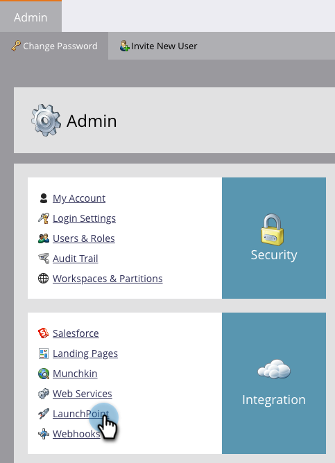

# Zoomen toevoegen als een opstartpuntservice {#add-zoom-as-a-launchpoint-service}

Marketo beheert uw zoomregistratie en aanwezigheid.

>[!NOTE]
>
>**Beheerdersmachtigingen vereist**

>[!NOTE]
>
>Voor deze stap is een bestaand abonnement op Zoomen en beheerrechten vereist. U moet beschikken over het e-mailadres en wachtwoord waarmee u zich kunt aanmelden bij Zoomen.

1. Ga naar **Admin** gebied en klik **LaunchPoint**.

   

1. Klik op de vervolgkeuzelijst **Nieuw** en selecteer **Nieuwe service**.

   

1. Voer een **Weergavenaam** in. Selecteer **Zoomen** onder **Service**.

   

1. Klik **Aanmelden bij zoomen**.

   

1. Voer in het aanmeldvenster Zoomen uw zoomgegevens in en klik op **Aanmelden**.

   

1. Nadat het venster wordt gesloten, klikt u op **Maken**.

   

   Geweldig! Uw zoomaccount is nu gesynchroniseerd met Marketo en bevindt zich in het gebied LaunchPoint.

>[!CAUTION]
>
>Wanneer u uw wachtwoord bijwerkt in Zoomen, moet u uw wachtwoord ook in Marketo bijwerken.

>[!MORELIKETHIS]
>
>Leer hoe u [een gebeurtenis maakt met Zoomen](/help/marketo/product-docs/demand-generation/events/create-an-event/create-an-event-with-zoom.md).
