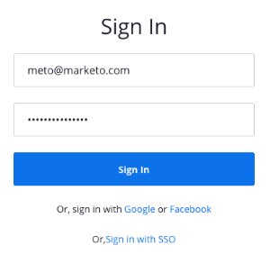

# [!DNL Zoom] toevoegen als een [!DNL LaunchPoint] -service {#add-zoom-as-a-launchpoint-service}

Marketo beheert uw registratie en aanwezigheid van [!DNL Zoom] .

>[!NOTE]
>
>**Vereiste Bevoegdheden Admin**

>[!NOTE]
>
>Voor deze stap zijn een bestaand abonnement op [!DNL Zoom] en beheerrechten vereist. U moet het e-mailadres en het wachtwoord hebben waarmee u zich aanmeldt bij [!DNL Zoom].

1. Ga naar het **[!UICONTROL Admin]** -gebied.

   

1. Klik op **[!UICONTROL LaunchPoint]**.

   

1. Selecteer **[!UICONTROL New]** en vervolgens **[!UICONTROL New Service]** .

   

1. Voer een **[!UICONTROL Display Name]** in. Selecteer onder **[!UICONTROL Service]** de optie **[!UICONTROL Zoom]** .

   

1. Klik op **[!UICONTROL Log Into Zoom]**.

   

1. Voer in het aanmeldvenster van [!DNL Zoom] uw [!DNL Zoom] referenties in en klik op **[!UICONTROL Sign in]** .

   

1. Klik op **[!UICONTROL Create]** nadat het venster is gesloten.

   

Uw [!DNL Zoom] -account is nu gesynchroniseerd met Marketo en bevindt zich in het [!UICONTROL LaunchPoint] -gebied.

>[!CAUTION]
>
>Wanneer u uw wachtwoord bijwerkt in [!DNL Zoom] , moet u uw wachtwoord ook in Marketo bijwerken.

>[!MORELIKETHIS]
>
>Leer hoe te om [&#x200B; een gebeurtenis met  [!DNL Zoom]](/help/marketo/product-docs/demand-generation/events/create-an-event/create-an-event-with-zoom.md) tot stand te brengen.
