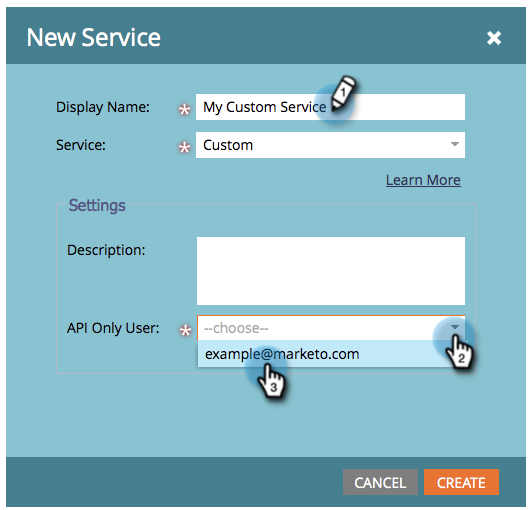

# Een aangepaste service maken voor gebruik met ReST API {#create-a-custom-service-for-use-with-rest-api}

Als u met Marketo wilt integreren via de ReST-API, maakt u een aangepaste service.

>[!PREREQUISITES]
>
>* [ creeer een slechtsAPI Rol van de Gebruiker ](/help/marketo/product-docs/administration/users-and-roles/create-an-api-only-user-role.md)
>* [ creeer een slechts Gebruiker API ](/help/marketo/product-docs/administration/users-and-roles/create-api-only-user.md)
>

>[!NOTE]
>
>**Vereiste Bevoegdheden Admin**

>[!TIP]
>
>Zie de documentatie van Ontwikkelaars voor details op [ REST API ](https://developer.adobe.com/marketo-apis/).

## Aangepaste service maken {#create-custom-service}

1. Ga naar het **[!UICONTROL Admin]** -gebied.

   

1. Klik op **[!UICONTROL LaunchPoint]** .

   

1. Selecteer **[!UICONTROL New]** en vervolgens **[!UICONTROL New Service]** .

   

1. Voer een **[!UICONTROL Display Name]** in voor de service. Selecteer **[!UICONTROL API Only User]** [ eerder gecreeerd ](/help/marketo/product-docs/administration/users-and-roles/create-api-only-user.md).

   

1. Klik op **[!UICONTROL Create]** .

   

   De service wordt nu gemaakt. Haal de referenties op om toegang te verlenen.

## Referenties voor API-toegang {#credentials-for-api-access}

1. Ga naar het **[!UICONTROL Admin]** -gebied.

   

1. Klik op **[!UICONTROL LaunchPoint]** .

   

1. Klik op **[!UICONTROL View Details]** voor de aangepaste [!UICONTROL LaunchPoint] -service die hierboven is gemaakt.

   

1. Klik op **[!UICONTROL Get Token]** .

   

1. Geef **[!UICONTROL Client Id]**, **[!UICONTROL Client Secret]**, **[!UICONTROL Authorized User]** en **[!UICONTROL Token]** door aan de persoon die verantwoordelijk is voor het tot stand brengen van de verbinding.

   

>[!CAUTION]
>
>Deel deze informatie niet, omdat deze toegang biedt tot uw gegevens.
