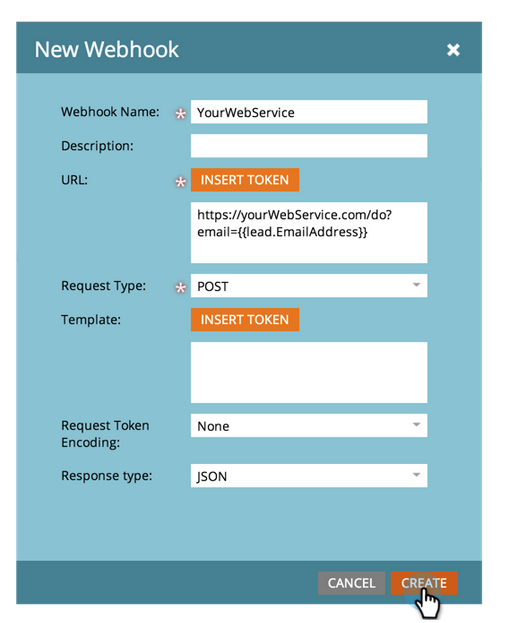

# Een [!DNL Webhook] {#create-a-webhook}

Gebruiken [!DNL Webhooks] om gebruik te maken van externe webservices voor het verzenden van tekstberichten, het uitbreiden van persoonlijke gegevens en nog veel meer.

>[!AVAILABILITY]
>
>Niet alle gebruikers van het Marketo Engage hebben deze functionaliteit aangeschaft. Neem contact op met het accountteam van de Adobe (uw accountmanager) voor meer informatie.

1. Ga naar de **[!UICONTROL Admin]** gebied.

   

1. Klik op **[!UICONTROL Webhooks]**.

   

1. Klik op **[!UICONTROL New Webhook]**.

   

1. Geef uw naam en configureer uw [!DNL Webhook].

   

   >[!NOTE]
   >
   >Dit omvat vaak het ingaan van uw derdedienstgeloofsbrieven als parameter URL, of in het malplaatje van de POST.

   * **[!UICONTROL URL]**: Voer de URL in die u in uw aanvraag voor de webservice gebruikt. Een token invoegen, zoals het e-mailadres van de persoon (**`{{lead.Email Address}}`**), klikt u in uw verzoek op **[!UICONTROL Insert Token]**.

   * **[!UICONTROL Template]**: Als u informatie in het lichaam van het verzoek wilt overbrengen, ga via het ladingsmalplaatje in. Sjablonen zijn toegestaan voor de volgende aanvraagtypen: POST, DELETE, PATCH of PUT. U kunt gegevensindelingen gebruiken, zoals JSON of XML. Als u een token wilt invoegen in uw sjabloon, klikt u op **[!UICONTROL Insert Token]**.

   * **[!UICONTROL Request Token Encoding]**: Als de tokenwaarden speciale tekens bevatten (zoals een en-teken &#39;&amp;&#39;), geeft u de indeling van uw verzoek op (**JSON** of **Formulier/URL**).

   * **[!UICONTROL Response type]**: Selecteer de indeling van de reactie die u van de service ontvangt (**JSON** of **XML**).

   * **[!UICONTROL Request Type]**: Selecteer de te gebruiken HTTP-methode (DELETE, GET, PATCH, POST, PUT).

1. Klik op **[!UICONTROL Create]**.

   

>[!NOTE]
>
>Meer informatie in het dialoogvenster [[!DNL Webhooks]](https://experienceleague.adobe.com/en/docs/marketo-developer/marketo/webhooks/webhooks){target="_blank"} diep duiken.
