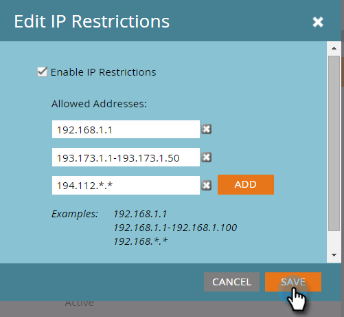

# Creeer een Lijst van gewenste personen voor IP-Gebaseerde Toegang API {#create-an-allowlist-for-ip-based-api-access}

Soms wilt u API-toegang alleen verlenen aan een specifiek IP-adres of een reeks adressen. Hiervoor moet u eerst beperkingen inschakelen en vervolgens de IP-adressen opgeven die de API&#39;s mogen gebruiken.

>[!NOTE]
>
>**Vereiste Bevoegdheden Admin**

>[!CAUTION]
>
>Het toelaten van deze eigenschap verhindert u tot de [ Server MCP van Marketo ](https://experienceleague.adobe.com/en/docs/marketo-developer/marketo/mcp-server){target="_blank"} op dit ogenblik toegang te hebben. Dit probleem zal naar verwachting in een komende release worden opgelost.

1. Ga naar het **[!UICONTROL Admin]** -gebied.

   

1. Klik op **[!UICONTROL Web Services]** .

   

1. Klik in het **[!UICONTROL IP Restrictions]** -gebied op **[!UICONTROL Edit]** of klik op **[!UICONTROL Edit IP Restrictions]** in de linkerbovenhoek.

   

1. Controleer de doos **[!UICONTROL Enable IP Restrictions]** en ga de IP adressen in u wilt Lijsten van gewenste personen.

   

   >[!NOTE]
   >
   >U kunt één enkel IP adres of een waaier van hen ingaan, of een vervanging gebruiken.

1. Klik op **[!UICONTROL Add]** om extra velden te openen en meer IP-adressen in te voeren.

   

1. Klik op **[!UICONTROL Save]** .

   
