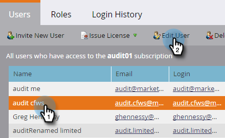

# Audittrail {#enable-audit-trail} inschakelen

Audittrail is beschikbaar voor alle klanten en wordt beheerd door twee beheerdersmachtigingen.

>[!NOTE]
>
>Door gebrek, hebben alle systeem admin rollen beide toegelaten toestemmingen.

## Audittrail inschakelen voor een rol {#enable-audit-trail-for-a-role}

1. Klik **Admin**.

   

1. Selecteer **Gebruikers &amp; rollen** en klik **Rollen**.

   

1. Selecteer de rol u het Spoor van de Controle voor wilt toelaten en **Edit Rol** klikken.

   

   >[!NOTE]
   >
   >U hebt hier ook de optie om een nieuwe rol te creëren en het toegang van het Spoor van de Controle te verlenen.

1. Breid **Toegang Admin** toestemming uit. Selecteer **Access Audit Trail** en/of **Access Login History**, afhankelijk van uw behoeften. Klik **Opslaan**.

   

   >[!NOTE]
   >
   >**Definitie**
   >
   >**Access Audit Trail:** geeft gebruikers toegang tot zowel Asset Audit Trail als Admin Audit Trail.
   >
   >**Toegang tot aanmeldingsgeschiedenis:** geeft gebruikers toegang tot  [gebruikersaanmeldingsgeschiedenis](/help/marketo/product-docs/administration/audit-trail/user-login-history.md).

## Taak audittrail toewijzen aan een gebruiker {#assign-audit-trail-role-to-a-user}

>[!PREREQUISITES]
>
> Creëer of   laat bestaande rol toe, die het de toestemmingen van het Spoor van de Controle geeft.

1. Klik in **Gebruikers &amp; rollen** op **Gebruikers**.

   

1. Selecteer de gebruiker u de toegang van het Spoor van de Controle tot wilt geven en **geef Gebruiker** uit.

   

   >[!NOTE]
   >
   >Dit proces is ook van toepassing wanneer u een nieuwe gebruiker creeert.

1. Selecteer de rollen van het Spoor van de Controle u creeerde. In dit voorbeeld hebben we &quot;Audit Trail - Asset en Admin&quot; en &quot;Audit Trail - With Login History&quot; gemaakt.

   

   >[!CAUTION]
   >
   >Als u werkruimten hebt ingeschakeld, schakelt u het selectievakje voor de rol in, waarmee alle werkruimten worden geselecteerd. Als u de selectie van een afzonderlijke werkruimte opheft, wordt Audittrail verborgen. Dit betekent u de gegevens van het Spoor van de Controle voor elke werkruimte zult zien. U kunt werkruimten verbergen wanneer [filteren](/help/marketo/product-docs/administration/audit-trail/filtering-in-audit-trail.md).

1. Klik **Opslaan**.

   
