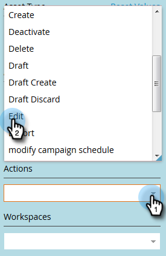

# Filteren in audittrail {#filtering-in-audit-trail}

Filter op tijdkader, type element, gebruikers, actie uitgevoerd en meer.

1. Klik op **[!UICONTROL Admin]**.

   

1. Selecteer onder **[!UICONTROL Security]** de optie **[!UICONTROL Audit Trail]** .

   

1. Klik op het filterpictogram.

   

   >[!NOTE]
   >
   >Er zijn vele mogelijke combinaties van zoekparameters. In dit voorbeeld vinden wij van: _alle e-mails - die door iedereen worden uitgegeven - in de vorige zeven dagen_.

1. Klik op de vervolgkeuzelijst **[!UICONTROL Period]** en selecteer **[!UICONTROL Last 7 Days]** .

   

1. Klik op de vervolgkeuzelijst **[!UICONTROL Asset Type]** en selecteer **[!UICONTROL Email]** .

   

1. Klik **a  actie** drop-down en selecteer **[!UICONTROL Edit]**.

   

1. Klik op **[!UICONTROL Apply]**.

   

1. De gefilterde resultaten worden links weergegeven.

   

   Dat is het!

   >[!NOTE]
   >
   >Als u werkruimten hebt ingeschakeld, ziet u controlegegevens voor alle werkruimten. Als u een werkruimtefilter toepast, onthoudt Marketo de vorige werkruimtewaarde telkens als u audittrail gebruikt. Workspace-machtigingen op middelenniveau worden afgedwongen.

   >[!MORELIKETHIS]
   >
   >[ Details van de Verandering in het Spoor van de Controle ](/help/marketo/product-docs/administration/audit-trail/change-details-in-audit-trail.md)
