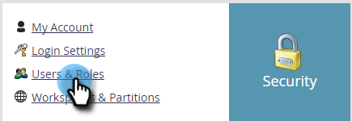
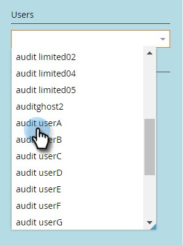

# Aanmeldingsgeschiedenis gebruiker {#user-login-history}

De historie van de gebruikersaanmelding helpt verantwoordingsplicht en beveiliging te behouden door precies aan te geven wie zich heeft aangemeld bij uw abonnement, inclusief mislukte aanmeldingspogingen.

>[!PREREQUISITES]
>
>U moet een rol hebben met de Toegangsvergunning die van de Geschiedenis van de Login van de Toegang wordt toegelaten om de Geschiedenis van de Login van de Gebruiker te bekijken.

De historie van de gebruikersaanmelding identificeert personen die zich aanmelden door:

* Aanmeldtijd en -datum
* Naam en e-mailadres van gebruiker
* Functie
* Workspace
* IP-adres

De aanmeldingsgeschiedenis van de gebruiker weergeven:

1. Ga naar het **[!UICONTROL Admin]** -gebied.

   

1. Klik onder Beveiliging op **[!UICONTROL Users & Roles]** .

   

1. Klik op de tab **[!UICONTROL Login History]** . De lijst toont de meest recente logins.

   

1. Gebruik het filter om uw zoekopdracht te beperken.

   

1. Selecteer een datumbereik met de datumkiezers.

   

1. Of kies een optie in het keuzemenu.

   

1. Selecteer de gebruikers in de vervolgkeuzelijst **[!UICONTROL Users]** .

   

1. Schakel het selectievakje **[!UICONTROL Only Failed Logins]** in om alleen mislukte aanmeldingen in uw zoekopdracht weer te geven.

   

1. Klik op **[!UICONTROL Apply]**.

   

   >[!NOTE]
   >
   >In de gebruikersinterface worden maximaal 30 dagen gegevens weergegeven. Als u meer nodig hebt, kunt u de meest recente zes maanden gegevens downloaden naar een CSV-bestand.

   >[!MORELIKETHIS]
   >
   >[&#x200B; Overzicht van het Spoor van de Controle &#x200B;](/help/marketo/product-docs/administration/audit-trail/audit-trail-overview.md)
