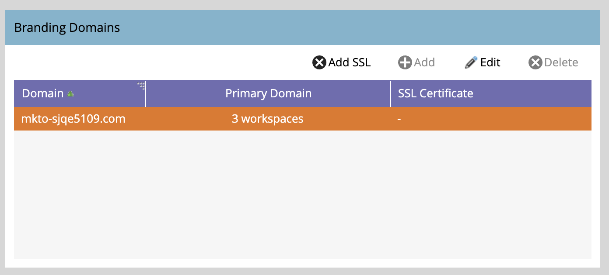

# Een extra brandingdomein toevoegen {#add-an-additional-branding-domain}

Voeg een extra branding domein toe wanneer u veelvoudige merken uit één enkel geval van Marketo in werking stelt en hen elk hun eigen merksporen verbindingen wilt hebben.

>[!PREREQUISITES]
>
>U moet [ de generische volgende verbinding ](/help/marketo/product-docs/administration/email-setup/add-multiple-branding-domains/edit-your-default-branding-domain.md){target="_blank"} met een branded domein vervangen alvorens extra branded domeinen toe te voegen.

1. Ga naar het **[!UICONTROL Admin]** -gebied.

   

1. Klik op **[!UICONTROL Email]**.

   

1. Klik op **[!UICONTROL Add]** om een extra brandingdomein toe te voegen.

   {width="600"}

1. Ga de naam van uw nieuw brandend domein in, selecteer _Primair Domein maken_ en/of _produceert SSL Certificaat_ (zowel facultatief), en klik **[!UICONTROL Save]**.

   

>[!NOTE]
>
>* _maak Primair Domein_: Maak dit uw primair domein, en alle bestaande onverzonden e-mails die aan &quot;Gebrek&quot;worden geplaatst en alle nieuw gecreëerde e-mails zullen aan het primaire domein in gebreke blijven. U kunt [ dit op een per-e-mailbasis ](/help/marketo/product-docs/administration/email-setup/add-multiple-branding-domains/overwrite-primary-domain-for-emails.md){target="_blank"} beschrijven.
>
>* _produceer SSL Certificaat_: U kunt een Veilige Laag van Contactdozen (SSL) met de verwezenlijking van het domein tot stand brengen. Het eerste volgende domein zal een éénmalige opstelling van infrastructuur in werking stellen die een paar uren kan vergen. U wordt op de hoogte gesteld wanneer de bewerking is voltooid en u kunt vervolgens het eerste domein instellen. Om SSL aan uw bestaande domeinen toe te voegen, te bereiken gelieve uit [ de Steun van Marketo ](https://nation.marketo.com/t5/support/ct-p/Support){target="_blank"}.

## SSL&#39;s voor bestaande domeinen bewerken

Ga als volgt te werk om SSL in te schakelen voor uw bestaande domeinen.

1. Selecteer in het gebied _[!UICONTROL Admin]_&#x200B;de optie **[!UICONTROL Email]**.

1. Selecteer op het tabblad _[!UICONTROL Domain]_&#x200B;de domeinrij en klik op **[!UICONTROL Add SSL]**.

   {width="600"} toe

1. Klik in het dialoogvenster op **[!UICONTROL Confirm]** .

   {width="400"}

## Foutberichten {#error-messages}

<table><thead>
  <tr>
    <th>Fout</th>
    <th>Details</th>
  </tr></thead>
<tbody>
<tr>
    <td><i>Domein bestaat al.</i></td>
    <td>Er bestaat al een domein met dezelfde naam.</td>
  </tr>
  <tr>
    <td><i>Domein wordt niet toegewezen aan het standaarddomein.</i></td>
    <td>Het aangepaste domein wordt niet correct toegewezen aan het standaarddomein. Verifieer de instellingen voor domeintoewijzing en zorg ervoor dat de DNS-configuratie naar het juiste standaarddomein wijst.</td>
  </tr>
  <tr>
    <td><i>SSL-certificaten kunnen niet worden uitgegeven vanwege niet-ondersteunde CAA-records. Vraag uw IT om uw CAA-records bij te werken.</i></td>
    <td>De CAA-records zijn niet bijgewerkt. Voor wie gebruikmaakt van door Marketo Engage beheerde SSL-certificaten, moeten CAA-records worden bijgewerkt naar certificaten die door onze leverancier worden aanbevolen. Neem contact op met uw IT-afdeling om de CAA-records bij te werken. Zie <a href="https://nation.marketo.com/t5/product-blogs/changes-to-marketo-engage-secured-domains-platform/ba-p/329305#M2246"> deze pagina </a> voor extra details.</td>
  </tr>
  <tr>
    <td><i>SSL-certificaat is al uitgegeven.</i></td>
    <td>Er bestaat al een SSL-certificaat voor dit aangepaste domein. Er is geen verdere actie nodig tenzij het certificaat is verlopen of opnieuw moet worden uitgegeven.</td>
  </tr>
  <tr>
    <td><i>Het standaarddomein is niet gevonden. Neem contact op met de Technische Ondersteuning voor hulp.</i></td>
    <td>Er is een probleem opgetreden bij het zoeken naar het standaarddomein. Neem contact op met de ondersteuningsafdeling zodat ze dit kunnen onderzoeken.</td>
  </tr>
  <tr>
    <td><i>Onverwachte fout aangetroffen tijdens het maken van een domein. Neem contact op met de Technische Ondersteuning voor hulp.</i></td>
    <td>Er is een onverwachte fout opgetreden. Gelieve te verzamelen logboeken en foutendetails, en escaleer de kwestie aan <a href="https://nation.marketo.com/t5/support/ct-p/Support" target="_blank"> de Steun van Marketo </a>.</td>
  </tr>
</tbody></table>

## Notities {#things-to-note}

* **DNS afbeelding voor domein aan Marketo Engage**: Alvorens domeinen in UI toe te voegen, moet u [ CNAMEs aan een Marketo-Geleverd domein ](https://experienceleague.adobe.com/nl/docs/marketo/using/getting-started/initial-setup/setup-steps#customize-your-landing-page-urls-with-a-cname){target="_blank"} in kaart brengen.

* **Aangepaste SSLs**: Als u douane SSL nodig hebt, gelieve a [ kaartje van de Steun ](https://nation.marketo.com/t5/support/ct-p/Support){target="_blank"} voor te leggen. Gebruik het selectievakje voor zelfbediening niet voor het maken van SSL.

* **Vooraf bestaande SSLs**: Terwijl het toevoegen van een domein, controleert het systeem reeds bestaande SSLs, die manueel kan zijn gecreeerd vroeger. Als u deze validatie tegenkomt, maakt u uw domein zonder SSL-ontwerp te selecteren en maken we er verbinding mee. [ de Steun van het Contact ](https://nation.marketo.com/t5/support/ct-p/Support){target="_blank"} meer extra details/opties.

* **Schrapping van domeinen**: Automatisch schrappend een domein **schrapt niet** het SSL certificaat. Deze handleiding voorkomt gebruikersfouten die ertoe leiden dat een website geen SSL-certificaten heeft. Als u de SSL certificaten wilt verwijderen, [ contactSteun ](https://nation.marketo.com/t5/support/ct-p/Support){target="_blank"}.

>[!MORELIKETHIS]
>
>[ geeft Uw Standaard brandend Domein ](/help/marketo/product-docs/administration/email-setup/add-multiple-branding-domains/edit-your-default-branding-domain.md){target="_blank"} uit
