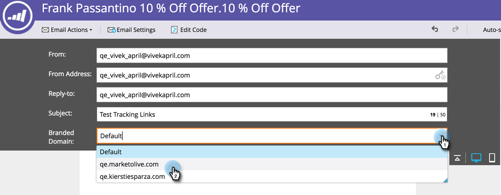

# Primair domein overschrijven voor e-mails {#overwrite-primary-domain-for-emails}

U kunt per e-mail het primaire branded domein overschrijven. Hiermee wijzigt u de manier waarop de koppelingen worden gemarkeerd wanneer het e-mailbericht wordt verzonden.

1. Ga naar **Marketingactiviteiten**.

   

1. Selecteer een e-mail en klik **Concept** bewerken.

   

1. Selecteer het brandingdomein dat u wilt gebruiken.

   

   >[!NOTE]
   >
   >Niet alle gebruikers hebben machtigingen om het merkdomein per e-mail in te stellen. Neem contact op met uw beheerder als u de vervolgkeuzelijst Gemarkeerde Domeinen niet ziet.
