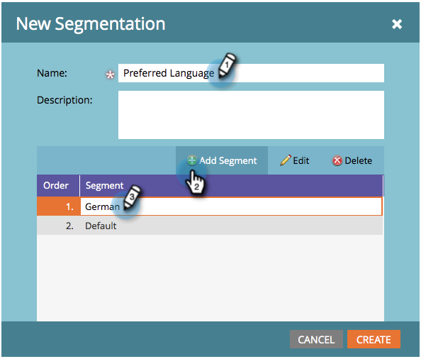
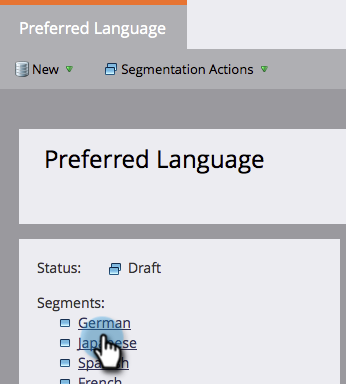
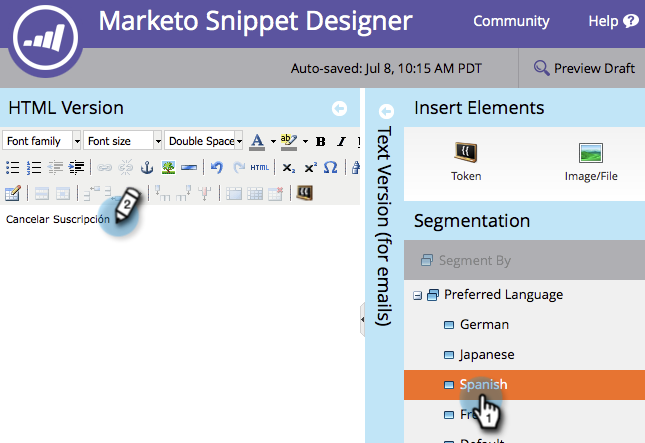
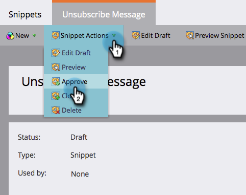

# Bericht voor opzeggen dynamisch maken voor talen {#make-your-unsubscribe-message-dynamic-for-languages}

Het standaardbericht en de koppeling voor afmelden zijn in het Engels beschikbaar. U kunt dynamische inhoud gebruiken om deze in verschillende talen weer te geven.

>[!NOTE]
>
>We hebben hieronder een mooie kleine zelfstudie voor je opgezet. Het vertegenwoordigt een beste praktijk, maar dit kan andere manieren worden verwezenlijkt.

## Uw gegevens {#prepare-your-data} voorbereiden

1. [Maak een aangepast ](/help/marketo/product-docs/administration/field-management/create-a-custom-field-in-marketo.md) veld met de naam &quot;Voorkeurstaal&quot;. (Stel deze in uw CRM in als u wilt dat dit veld wordt gesynchroniseerd).

   >[!TIP]
   >
   >Gebruik dit veld in de toekomst wanneer u [een formulier maakt](/help/marketo/product-docs/demand-generation/forms/creating-a-form/create-a-form.md) om taalvoorkeur vast te leggen.

## Segmentatie {#create-segmentation} maken

1. Ga naar **Database**.

   

1. Klik in de vervolgkeuzelijst **Nieuw** op **Nieuwe segmentatie**.

   

1. Geef de segmentatie **Voorkeurstaal** een naam. Klik **Segment toevoegen**. Typ een taal.

   

   >[!NOTE]
   >
   >Het standaardsegment zal Engels zijn.

1. Blijf segmenten toevoegen totdat alle talen worden weergegeven. Klik **Maken**.

   

1. Selecteer een segment.

   

1. Ga naar **Slimme lijst** tabel. Typ **Voorkeurstaal** in het zoekveld. Sleep het filter naar het canvas.

   

1. Stel de gewenste taal in.

   

1. Herhaal dit voor alle verschillende talen. Selecteer vervolgens de vervolgkeuzelijst **Segmenteringsacties** en klik op **Goedkeuren**.

   

## Een fragment maken {#create-a-snippet}

1. Ga naar **Design Studio**.

   

1. Klik in het vervolgkeuzemenu **Nieuw** op **Nieuw fragment**.

   

1. Geef het fragment **Abonnement op bericht opzeggen** een naam. Klik **Maken**.

   

1. Typ uw standaard afmeldingsbericht, markeer het en klik op het hyperlinkpictogram.

   

1. Kopieer en plak deze token: `{{system.unsubscribeLink}}` in het **veld URL koppelen**. Klik **Invoegen**.

   

1. Selecteer **Segment door** in de sectie van de Segmentatie.

   

1. Typ in het keuzemenu Segmentatie de optie **Voorkeur** en selecteer **Voorkeurstaal**. Klik **Opslaan**.

   

1. Selecteer een segment in de structuur. Typ uw afmeldingsbericht in die taal.

   

1. Hetzelfde token kopiëren en plakken: `{{system.unsubscribeLink}}` in het **veld URL koppelen**. Klik **Invoegen**.

   

1. Herhaal dit voor alle segmenten. Dan, ga terug naar de Studio van het Ontwerp, klik **de drop-down Acties van het Fragment**, en klik **goedkeuren**.

   

   Geweldig. Bijna.

## Fragment gebruiken in een e-mail {#use-snippet-in-an-email}

1. Klik in de e-maileditor op het bewerkbare element. Klik vervolgens op het tandwielpictogram en selecteer **Vervangen door fragment**. Als u een bewerkbaar fragmentelement selecteert, klikt u op het tandwielpictogram en selecteert u **Bewerken**.

   

1. Zoek en selecteer het fragment in de vervolgkeuzelijst en klik op **Opslaan**.

   

1. Om het uit te testen, klik **Terug**..

   

1. ...Dan **Dynamisch** tabel.

   

1. Klik op de verschillende talen om de fragmentwijziging te zien.

   

   >[!TIP]
   >
   >Natuurlijk kunt u de rest van uw e-mail ook voor dynamische taal bewerken. Voer dezelfde techniek uit op de pagina voor het opzeggen van het abonnement terwijl u er bent.

## Uw abonnementspagina aanpassen met dynamische inhoud {#customizing-your-unsubscribe-page-with-dynamic-content}

Als u wilt dat de mensen naar een pagina komen die hun abonnement opzegt in de taal van hun voorkeur, kunt u dynamische inhoud op de landingspagina en de bevestigingspagina gebruiken.

1. Navigeer naar de Design Studio.

   

1. Typ _Abonnement opzeggen_ in het zoekveld. Je moet je afmeldingspagina&#39;s vinden.

   

1. Klik **Concept bewerken**.

   

1. Selecteer **Segment door**.

   

1. Zoek het segment Voorkeurstaal. Klik **Opslaan**.

   

   Bewerk de inhoud voor elke bestemmingspagina, geef uw toestemming en u kunt het beste gaan!

   >[!NOTE]
   >
   >Meer informatie over [dynamische inhoud](/help/marketo/product-docs/personalization/segmentation-and-snippets/segmentation/understanding-dynamic-content.md) en alle leuke dingen die u kunt doen.
