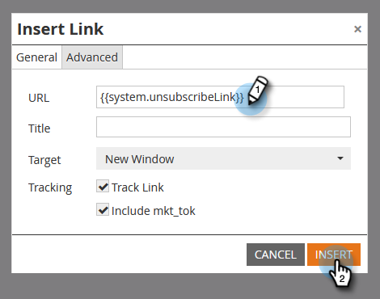

# Bericht voor opzeggen dynamisch maken voor talen {#make-your-unsubscribe-message-dynamic-for-languages}

Het standaardbericht en de koppeling voor afmelden zijn in het Engels beschikbaar. U kunt dynamische inhoud gebruiken om deze in verschillende talen weer te geven.

>[!NOTE]
>
>Dit artikel is een aanbevolen werkwijze, maar u kunt dit op andere manieren doen.

## Uw gegevens voorbereiden {#prepare-your-data}

1. [&#x200B; creeer een douanegebied &#x200B;](/help/marketo/product-docs/administration/field-management/create-a-custom-field-in-marketo.md) genoemd &quot;Voorkeur Taal.&quot; (Stel deze in uw CRM in als u wilt dat dit veld wordt gesynchroniseerd).

   >[!TIP]
   >
   >In de toekomst, gebruik dit gebied wanneer u [&#x200B; een vorm &#x200B;](/help/marketo/product-docs/demand-generation/forms/creating-a-form/create-a-form.md) creeert om taalvoorkeur te vangen.

## Segmentatie maken {#create-segmentation}

1. Ga naar de **[!UICONTROL Database]** .

   

1. Klik in de vervolgkeuzelijst **[!UICONTROL New]** op **[!UICONTROL New Segmentation]** .

   

1. Geef de segmentatie een naam **[!UICONTROL Preferred Language]**. Klik op **[!UICONTROL Add Segment]**. Typ een taal.

   

   >[!NOTE]
   >
   >Het standaardsegment zal Engels zijn.

1. Blijf segmenten toevoegen totdat alle talen worden weergegeven. Klik op **[!UICONTROL Create]**.

   

1. Selecteer een segment.

   

1. Ga naar de tab **[!UICONTROL Smart List]** . Typ **[!UICONTROL Preferred Language]** in het zoekveld. Sleep het filter naar het canvas.

   

1. Stel de gewenste taal in.

   

1. Herhaal dit voor alle verschillende talen. Selecteer vervolgens de vervolgkeuzelijst **[!UICONTROL Segmentation Actions]** en klik op **[!UICONTROL Approve]** .

   

## Een fragment maken {#create-a-snippet}

1. Ga naar de **[!UICONTROL Design Studio]** .

   

1. Klik in het vervolgkeuzemenu **[!UICONTROL New]** op **[!UICONTROL New Snippet]** .

   

1. Noem het fragment **Unsubscribe Bericht**. Klik op **[!UICONTROL Create]**.

   

1. Typ uw standaard afmeldingsbericht, markeer het en klik op het hyperlinkpictogram.

   

1. Kopieer en plak deze token: `{{system.unsubscribeLink}}` in het veld **[!UICONTROL URL]** . Klik op **[!UICONTROL Insert]**.

   

1. Selecteer **[!UICONTROL Segment By]** in de sectie **[!UICONTROL Segmentation]** .

   

1. Typ in de vervolgkeuzelijst **[!UICONTROL Segmentation]** de tekst **[!UICONTROL Preferred]** en selecteer **[!UICONTROL Preferred Language]** . Klik op **[!UICONTROL Save]**.

   

1. Selecteer een segment in de structuur. Klik op uw abonnement en klik vervolgens op het koppelingspictogram.

   

1. Zorg ervoor dat `{{system.unsubscribeLink}}` zich nog steeds in het **[!UICONTROL URL]** -veld bevindt. Bewerk de **[!UICONTROL Display Text]** in overeenstemming met de taal die u hebt geselecteerd. Klik op **[!UICONTROL Apply]**.

   

1. Herhaal dit voor alle segmenten. Ga vervolgens terug naar de **[!UICONTROL Design Studio]** , klik op de vervolgkeuzelijst **[!UICONTROL Snippet Actions]** en klik op **[!UICONTROL Approve]** .

   

Geweldig. Bijna daar!

## Fragment gebruiken in een e-mail {#use-snippet-in-an-email}

1. Klik in de e-maileditor op het bewerkbare element. Klik vervolgens op het tandwielpictogram en selecteer **[!UICONTROL Replace with Snippet]** . Als u een bewerkbaar fragmentelement selecteert, klikt u op het tandwielpictogram en selecteert u **[!UICONTROL Edit]** .

   

1. Zoek en selecteer het fragment in de vervolgkeuzelijst en klik op **[!UICONTROL Save]** .

   

1. Klik op **[!UICONTROL Back]**..

   

1. ...dan de tab **[!UICONTROL Dynamic]** .

   

1. Klik op de verschillende talen om de fragmentwijziging te zien.

   

   >[!TIP]
   >
   >Natuurlijk kunt u de rest van uw e-mail ook voor dynamische taal bewerken. Voer dezelfde techniek uit op de pagina voor het opzeggen van het abonnement terwijl u er bent.

## Je abonnementspagina aanpassen met dynamische inhoud {#customizing-your-unsubscribe-page-with-dynamic-content}

Als u wilt dat de mensen naar een pagina komen die hun abonnement opzegt in de taal van hun voorkeur, kunt u dynamische inhoud op de landingspagina en de bevestigingspagina gebruiken.

1. Navigeer naar de map **[!UICONTROL Design Studio]** .

   

1. Het type in _Unsubscribe_ op het onderzoeksgebied en selecteert uw gewenste pagina Unsubscribe.

   

1. Klik op **[!UICONTROL Edit Draft]**.

   

1. Selecteer **[!UICONTROL Segment By]**.

   

1. Zoek het segment **[!UICONTROL Preferred Language]** . Klik op **[!UICONTROL Save]**.

   

   Bewerk de inhoud voor elke bestemmingspagina, geef uw toestemming en u kunt het beste gaan!

   >[!NOTE]
   >
   >Leer meer over [&#x200B; dynamische inhoud &#x200B;](/help/marketo/product-docs/personalization/segmentation-and-snippets/segmentation/understanding-dynamic-content.md) en al koel materiaal u kunt doen.
