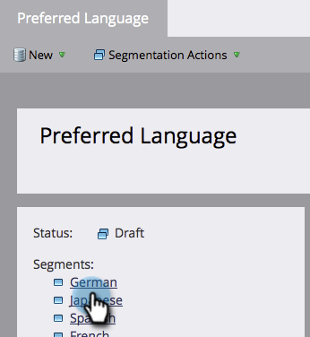

# Bericht voor opzeggen dynamisch maken voor talen {#make-your-unsubscribe-message-dynamic-for-languages}

Het standaardbericht en de koppeling voor afmelden zijn in het Engels beschikbaar. U kunt dynamische inhoud gebruiken om deze in verschillende talen weer te geven.

>[!NOTE]
>
>Dit artikel is een aanbevolen werkwijze, maar u kunt dit op andere manieren doen.

## Uw gegevens voorbereiden {#prepare-your-data}

1. [Een aangepast veld maken](/help/marketo/product-docs/administration/field-management/create-a-custom-field-in-marketo.md) met de naam &quot;Voorkeurstaal&quot;. (Stel deze in uw CRM in als u wilt dat dit veld wordt gesynchroniseerd).

   >[!TIP]
   >
   >Gebruik dit veld in de toekomst wanneer u [een formulier maken](/help/marketo/product-docs/demand-generation/forms/creating-a-form/create-a-form.md) om taalvoorkeur vast te leggen.

## Segmentatie maken {#create-segmentation}

1. Ga naar de **Database**.

   

1. In de **Nieuw** vervolgkeuzelijst, klikken **Nieuwe segmentatie**.

   

1. Geef de segmentatie een naam **Voorkeurstaal**. Klikken **Segment toevoegen**. Typ een taal.

   

   >[!NOTE]
   >
   >Het standaardsegment zal Engels zijn.

1. Blijf segmenten toevoegen totdat alle talen worden weergegeven. Klikken **Maken**.

   

1. Selecteer een segment.

   

1. Ga naar de **Slimme lijst** tab. Enter **Voorkeurstaal** in het zoekveld. Sleep het filter naar het canvas.

   

1. Stel de gewenste taal in.

   

1. Herhaal dit voor alle verschillende talen. Selecteer vervolgens de **Segmentatiehandelingen** vervolgkeuzelijst en klik op **Goedkeuren**.

   

## Een fragment maken {#create-a-snippet}

1. Ga naar de **Design Studio**.

   

1. In de **Nieuw** vervolgkeuzelijst, klikken **Nieuw fragment**.

   

1. Het fragment een naam geven **Abonnement opzeggen**. Klikken **Maken**.

   

1. Typ uw standaard afmeldingsbericht, markeer het en klik op het hyperlinkpictogram.

   

1. Kopieer en plak deze token: `{{system.unsubscribeLink}}` in de **URL** veld. Klikken **Invoegen**.

   

1. Selecteren **Segment op** in de sectie Segmentatie.

   

1. Typ in het keuzemenu Segmentatie **Voorkeur** en selecteert u **Voorkeurstaal**. Klikken **Opslaan**.

   

1. Selecteer een segment in de structuur. Klik op uw abonnement en klik vervolgens op het koppelingspictogram.

   

1. Controleer of `{{system.unsubscribeLink}}` bevindt zich nog in het veld URL. Bewerk de weergavetekst in overeenstemming met de taal die u hebt geselecteerd. Klikken **Toepassen**.

   

1. Herhaal dit voor alle segmenten. Dan, ga terug naar de Studio van het Ontwerp, klik **Fragmenthandelingen** en klik op **Goedkeuren**.

   

Geweldig. Bijna daar!

## Fragment gebruiken in een e-mail {#use-snippet-in-an-email}

1. Klik in de e-maileditor op het bewerkbare element. Klik vervolgens op het tandwielpictogram en selecteer **Vervangen door fragment**. Als u een bewerkbaar fragmentelement selecteert, klikt u op het tandwielpictogram en selecteert u **Bewerken**.

   

1. Uw fragment zoeken en selecteren in de keuzelijst en klikken **Opslaan**.

   

1. Klik op **Vorige**...

   

1. ...dan de **Dynamisch** tab.

   

1. Klik op de verschillende talen om de fragmentwijziging te zien.

   

   >[!TIP]
   >
   >Natuurlijk kunt u de rest van uw e-mail ook voor dynamische taal bewerken. Voer dezelfde techniek uit op de pagina voor het opzeggen van het abonnement terwijl u er bent.

## Je abonnementspagina aanpassen met dynamische inhoud {#customizing-your-unsubscribe-page-with-dynamic-content}

Als u wilt dat de mensen naar een pagina komen die hun abonnement opzegt in de taal van hun voorkeur, kunt u dynamische inhoud op de landingspagina en de bevestigingspagina gebruiken.

1. Ga naar de **Design Studio**.

   

1. Type in _Abonnement opzeggen_ in het zoekveld en selecteert u de gewenste pagina Abonnement opzeggen.

   

1. Klikken **Concept bewerken**.

   

1. Selecteren **Segment op**.

   

1. Zoek het segment Voorkeurstaal. Klikken **Opslaan**.

   

   Bewerk de inhoud voor elke bestemmingspagina, geef uw toestemming en u kunt het beste gaan!

   >[!NOTE]
   >
   >Meer informatie over [dynamische inhoud](/help/marketo/product-docs/personalization/segmentation-and-snippets/segmentation/understanding-dynamic-content.md) en alle coole dingen die je kunt doen.
