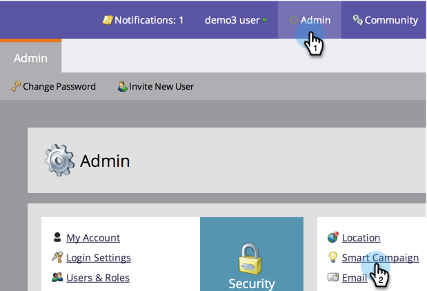

# Personenbeperkingen inschakelen voor slimme campagnes {#enable-person-restrictions-for-smart-campaigns}

Er is een functie in Marketo om het _maximum_ aantal mensen te beperken dat voor een slimme campagne in aanmerking kan komen. Zo voorkomt u dat per ongeluk uw gehele database wordt gemaild.

>[!NOTE]
>
>**Beheerdersmachtigingen vereist**

>[!CAUTION]
>
>Dit geldt alleen voor batchcampagnes en e-mailprogramma&#39;s.

1. Klik **Admin** en dan **Slimme Campagne**.

   

1. Klik **Bewerken**.

   

   >[!CAUTION]
   >
   >Als het aantal personen dat in aanmerking komt om een slimme campagne te doorlopen de ingestelde limiet overschrijdt, wordt deze helemaal niet uitgevoerd.

1. Voer een limiet in en klik op **Opslaan**.

   

   >[!TIP]
   >
   >Schakel deze functie uit door dit veld leeg te maken.

   >[!CAUTION]
   >
   >Deze limiet geldt voor alle slimme campagnes, maar kan op campagnereniveau worden overschreven. Leer hoe te om persoonbeperkingen in een slimme campagne [met voeten te treden.](/help/marketo/product-docs/core-marketo-concepts/smart-campaigns/using-smart-campaigns/override-person-restrictions-in-a-smart-campaign.md)

Bingo! Je hebt net de veiligheidsschakelaar ingeschakeld. Goed idee, toch?

>[!MORELIKETHIS]
>
>[Persoonlijke beperkingen in een slimme campagne negeren](/help/marketo/product-docs/core-marketo-concepts/smart-campaigns/using-smart-campaigns/override-person-restrictions-in-a-smart-campaign.md)
