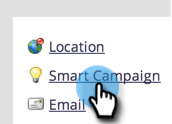
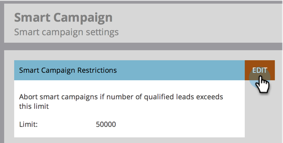

# Personenbeperkingen voor slimme campagnes inschakelen {#enable-person-restrictions-for-smart-campaigns}

Er is een eigenschap in Marketo om het _maximum_ aantal mensen te beperken die voor een Slimme Campagne kunnen kwalificeren. Zo voorkomt u dat per ongeluk uw gehele database wordt gemaild.

>[!NOTE]
>
>**Vereiste Bevoegdheden Admin**

>[!CAUTION]
>
>Dit geldt alleen voor batchcampagnes en e-mailprogramma&#39;s.

1. Ga naar het **[!UICONTROL Admin]** -gebied.

   

1. Klik op **[!UICONTROL Smart Campaign]**.

   

1. Klik op **[!UICONTROL Edit]**.

   

   >[!CAUTION]
   >
   >Als het aantal personen dat in aanmerking komt om een slimme campagne te doorlopen, de ingestelde limiet overschrijdt, wordt deze helemaal niet uitgevoerd.

1. Voer een limiet in en klik op **[!UICONTROL Save]** .

   

   >[!TIP]
   >
   >Schakel deze functie uit door dit veld leeg te maken.

   >[!CAUTION]
   >
   >Deze limiet geldt voor alle slimme campagnes, maar kan worden overschreven op campagnereniveau. Leer hoe te [ persoonlijke beperkingen in een Slimme Campagne ](/help/marketo/product-docs/core-marketo-concepts/smart-campaigns/using-smart-campaigns/override-person-restrictions-in-a-smart-campaign.md) met voeten treden.

Gereed! Je hebt net de veiligheidsschakelaar aangezet.

>[!MORELIKETHIS]
>
>[ treedt de Beperkingen van de Persoon in een Slimme Campagne ](/help/marketo/product-docs/core-marketo-concepts/smart-campaigns/using-smart-campaigns/override-person-restrictions-in-a-smart-campaign.md) op
