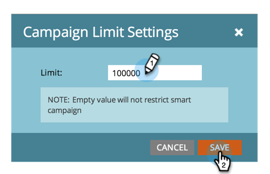

# Personenbeperkingen voor slimme campagnes inschakelen {#enable-person-restrictions-for-smart-campaigns}

Er is een functie in Marketo om de _maximum_ aantal personen dat in aanmerking komt voor een slimme campagne. Zo voorkomt u dat per ongeluk uw gehele database wordt gemaild.

>[!NOTE]
>
>**Beheerdersmachtigingen vereist**

>[!CAUTION]
>
>Dit geldt alleen voor batchcampagnes en e-mailprogramma&#39;s.

1. Ga naar de **Beheer** gebied.

   

1. Klikken **Slimme campagne**.

   

1. Klikken **Bewerken**.

   

   >[!CAUTION]
   >
   >Als het aantal personen dat in aanmerking komt om een slimme campagne te doorlopen de ingestelde limiet overschrijdt, wordt deze helemaal niet uitgevoerd.

1. Voer een limiet in en klik op **Opslaan**.

   

   >[!TIP]
   >
   >Schakel deze functie uit door dit veld leeg te maken.

   >[!CAUTION]
   >
   >Deze limiet geldt voor alle slimme campagnes, maar kan op campagnereniveau worden overschreven. Leer hoe u [persoonlijke beperkingen in een slimme campagne negeren](/help/marketo/product-docs/core-marketo-concepts/smart-campaigns/using-smart-campaigns/override-person-restrictions-in-a-smart-campaign.md).

Gereed! Je hebt net de veiligheidsschakelaar ingeschakeld.

>[!MORELIKETHIS]
>
>[Persoonlijke beperkingen in een slimme campagne negeren](/help/marketo/product-docs/core-marketo-concepts/smart-campaigns/using-smart-campaigns/override-person-restrictions-in-a-smart-campaign.md)
