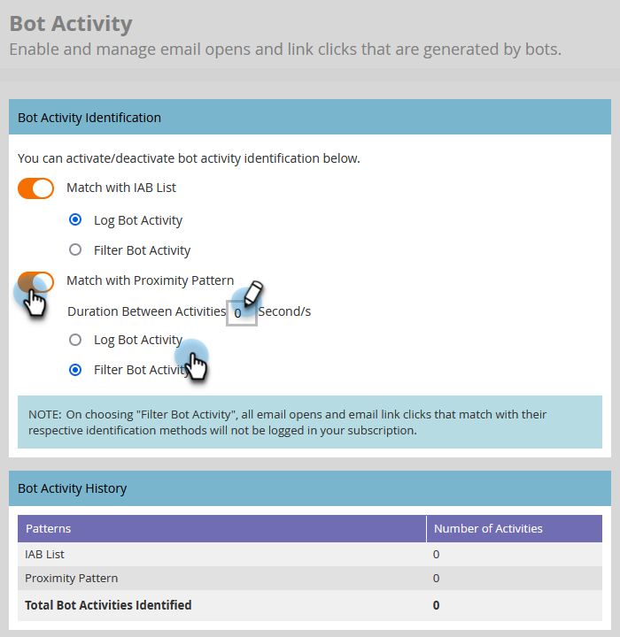

# TEMP voor het filteren van de activiteit van de e-mail{#filtering-email-bot-activity}

Soms kan e-mailactiviteit je e-mail abusievelijk opblazen en op gegevens klikken. Voer de onderstaande stappen uit om dat te verhelpen.

We gebruiken twee verschillende methoden om beide activiteiten te bevestigen:

* Afstemmen met [Interactieve lijst van adverteerders van het Bureau](https://www.iab.com/guidelines/iab-abc-international-spiders-bots-list/){target="_blank"}: Activiteiten die overeenkomen met alles in de lijst IAB UA/IP (User Agent/IP-adres) worden gemarkeerd als bots.
* Overeenkomst met nabijheidspatroon: wanneer meer dan twee activiteiten tegelijkertijd plaatsvinden (in minder dan een seconde), worden ze geïdentificeerd als bots. Kenmerken die in aanmerking worden genomen tijdens de vergelijking zijn:
   * ID lead (moet hetzelfde zijn)
   * E-mailmiddel (moet hetzelfde zijn)
   * Klik op Koppelen of e-mail openen
   * Tijdverschil (zou minder dan één seconde moeten zijn)

Bij klikken op een e-mailkoppeling en e-mail openen worden nieuwe kenmerken gevuld met de onderstaande waarden:

* Activiteiten die als bots worden geïdentificeerd, hebben &quot;Bot Activity&quot; als &quot;True&quot; en &quot;Bot Activity Pattern&quot; als het geïdentificeerde patroon/de geïdentificeerde methode
* Activiteiten die niet als bots worden aangeduid, hebben &quot;Bot Activity&quot; als &quot;False&quot; en &quot;Bot Activity Pattern&quot; als &quot;N/A&quot;
* Activiteiten die zijn uitgevoerd voordat we deze kenmerken hebben geïntroduceerd, hebben &quot;Bot Activity&quot; als &quot; (leeg) en &quot;Bot Activity Pattern&quot; als &quot; &quot; (leeg)

## Filtertype selecteren {#select-filter-type}

1. Klik op **[!UICONTROL Admin]**.

   

1. Klik op **[!UICONTROL Email]**.

   

1. Klik op de knop **[!UICONTROL Bot Activity]** tab.

   

1. Er zijn twee schuifregelaars waaruit u kunt kiezen. U kunt slechts één of beide inschakelen. Als u **[!UICONTROL Match with IAB List]**, kiest u of [!UICONTROL log bot activity] _of_ [!UICONTROL filter bot activity].

   

1. Als u **[!UICONTROL Match with Proximity Pattern]**, kiest u of [!UICONTROL log bot activity] _of_ [!UICONTROL filter bot activity]. U kunt ook de hoeveelheid seconden instellen voor **Looptijd tussen activiteiten** (standaardwaarde is 0, max is 3).

   

>[!NOTE]
>
>Met **Looptijd tussen activiteiten** Stel dit in op 0 seconden, dan identificeren we e-mailactiviteiten die precies op dezelfde seconde plaatsvinden. Als er binnen de opgegeven hoeveelheid seconden meerdere e-mailactiviteiten plaatsvinden, wordt deze geïdentificeerd als beide activiteiten.

>[!IMPORTANT]
>
>* Als u [!UICONTROL Filter Bot Activity]Er wordt mogelijk een druppel weergegeven in het e-mailbericht en er wordt geklikt omdat onjuiste activiteiten worden uitgespoord.

**OPTIONELE STAP**: Als u een van beide functies wilt uitschakelen, schakelt u gewoon de desbetreffende schuifregelaar uit. Als u dat wel doet, worden de gegevens niet opnieuw ingesteld.

>[!TIP]
>
>Gebruik beide activiteitsgegevens in slimme lijsten via Booleaanse waarden (ja/nee) en Activiteit (beide) in de filters &quot;Klikte koppeling in e-mail&quot; en &quot;E-mail openen&quot;, en klik op Koppeling in e-mail en &quot;E-mail openen&quot;.

## IP LIJST VAN GEWEZEN PERSONEN {#ip-blocklist}

Wij hebben een lijst van IP adressen gecompileerd die voor het produceren van miljoenen valse overeenkomsten verantwoordelijk zijn, aangezien zulk engagement die van om het even welke volgende IPs wordt ontvangen automatisch wordt gefilterd uit en niet toegevoegd aan uw Instantie van het Marketo Engage. Dit kan leiden tot minder e-mail openen, klikken en andere gerelateerde activiteiten. De onderstaande lijst kan periodiek worden bijgewerkt.

* 40 94 34 52
* 40 94 34 86
* 52 34 76 65
* 54 70 53 60
* 54 71 187 124
* 60.28.2.248
* 64 235 150 252
* 64 235 153 10
* 64 235 153,2
* 64 235 154 105
* 64 235 154 109
* 64 235 154 140
* 64 74 215,1
* 64 74 215 100
* 64 74 215 138
* 64 74 215 139
* 64 74 215 142
* 64 74 215 146
* 64 74 215 150
* 64 74 215 154
* 64 74 215 158
* 64 74 215 162
* 64 74 215 164
* 64 74 215 166
* 64 74 215 170
* 64 74 215 174
* 64 74 215 176
* 64 74 215 178
* 64 74 215 51
* 64 74 215,56
* 64 74 215,58
* 64 74 215,59
* 64 74 215,86
* 64 74 215,98
* 65 154 226 101
* 66 249 91 149
* 70 42 131 106
* 74 125 217 116
* 74 217 90 250
* 104 129 41,4
* 104 47 55 126
* 104 47 58 126
* 104 47 70 126
* 104 47 73 126
* 104 47 73 254
* 104 47 74 126
* 128 220 160,1
* 15.70.39.101
* 162 129 251,14
* 162 129 251,42
* Op 20.52.157.2004

>[!NOTE]
>
>Wij analyseren en onderzoeken nauwgezet elk IP adres alvorens het aan deze lijst toe te voegen, ervoor zorgen slechts de meest kritieke en schadelijke IPs wordt geblokkeerd.
