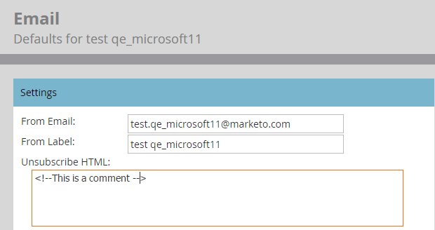

# Tekst voor afmelden verwijderen uit de sectie {#remove-unsubscribe-text-from-the-admin-email-section} voor e-mailadressen van beheerders

De enige reden waarom u het afmelden van inhoud uit het gebied &quot;Admin > E-mail&quot;zou moeten ooit volledig verwijderen is als u verkiest om de afmeldingsverbinding in de e-mailmalplaatjes zelf te bouwen. Het tekstvak heeft een validatie die het niet mogelijk maakt om zonder inhoud op te slaan. U kunt dit omzeilen door een kleine HTML-opmerking toe te voegen. De HTML-opmerking wordt niet weergegeven in de e-mailclient, omdat deze de e-mail in HTML weergeeft en de opmerkingen worden weggelaten. Zo doe je het.

1. Ga naar **Admin** en klik **E-mail**.

   

1. Selecteer alle tekst en druk op **Delete**.

   >[!CAUTION]
   >
   >Kopieer of plak deze vóór het verwijderen in een tekstdocument als een back-up.

1. Typ in `<!--This is a comment -->`.

   

1. Klik **Wijzigingen opslaan**.

   

>[!NOTE]
>
>Voor **Unsubscribe Text** moet u één enkel karakter toevoegen. Gebruik een streepje of een punt.
