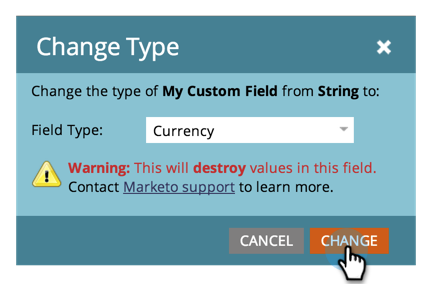

# Het type van een aangepast Marketo-veld wijzigen {#change-the-type-of-a-marketo-custom-field}

Hieronder wordt beschreven hoe u het veldtype van een aangepast veld wijzigt.

1. Ga naar het **[!UICONTROL Admin]** -gebied.

   

1. Klik op **[!UICONTROL Field Management]**.

   

1. Zoek en selecteer het gewenste veld.

   

1. Klik in de vervolgkeuzelijst **[!UICONTROL Field Actions]** op **[!UICONTROL Change Type]** .

   

1. Selecteer het nieuwe type.

   >[!NOTE]
   >
   >Score- en formulevelden kunnen niet worden gewijzigd.

   

1. Lees de waarschuwing en klik vervolgens op **[!UICONTROL Change]** om te bevestigen.

   

   >[!NOTE]
   >
   >Het waarschuwingsbericht dat u ziet, is afhankelijk van het veldtype dat u wilt wijzigen.

   >[!MORELIKETHIS]
   >
   >[&#x200B; creeer een Gebied van de Douane in Marketo &#x200B;](/help/marketo/product-docs/administration/field-management/create-a-custom-field-in-marketo.md)
