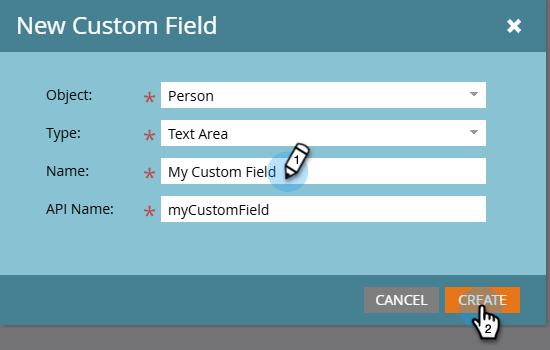

# Een aangepast veld maken in Marketo {#create-a-custom-field-in-marketo}

Als u een nieuw aangepast veld in Marketo Engage nodig hebt om gegevens op te slaan/vast te leggen, gaat u als volgt te werk:

1. Ga naar het **[!UICONTROL Admin]** -gebied.

   

1. Klik op **[!UICONTROL Field Management]**.

   

   >[!TIP]
   >
   >Als u wilt dat de velden synchroon blijven met uw CRM, maakt u deze in de CRM-toepassing en maakt u ze automatisch in Marketo.

1. Klik op **[!UICONTROL New Custom Field]**.

   

1. Kies de _[!UICONTROL Object]_.

   

   >[!NOTE]
   >
   >Terwijl u niet het _voorwerp van het Bedrijf_ kunt selecteren zelf, kunt u het verzoeken door [ de Steun van Marketo ](https://nation.marketo.com/t5/support/ct-p/Support){target="_blank"} te contacteren.

1. Kies het veld _[!UICONTROL Type]_. Hiermee wijzigt u de weergave in slimme lijsten en formulieren in Marketo.

   >[!TIP]
   >
   >Controle uit de [ Verklarende woordenlijst van de Types van Gebied van de Douane ](/help/marketo/product-docs/administration/field-management/custom-field-type-glossary.md){target="_blank"}.

   

1. Voer de _[!UICONTROL Name]_in zoals u deze wilt weergeven in Marketo (de_[!UICONTROL API Name]_ wordt automatisch gegenereerd). Kies zorgvuldig, omdat de naam niet kan worden gewijzigd na het opslaan. Klik op **[!UICONTROL Create]** als u klaar bent.

>[!CAUTION]
>
>Veldnamen mogen niet met de volgende tekens beginnen: **. &amp; +[]**

>[!NOTE]
>
>De API-naam wordt gebruikt door de SOAP API en andere back-endprocessen.

U kunt dit aangepaste veld nu gebruiken in formulieren, stroomstappen en slimme lijsten.
