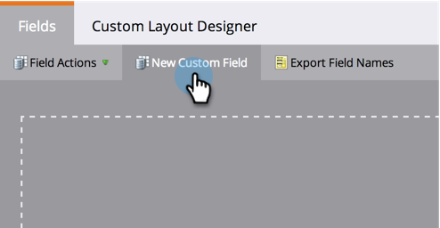

# Een samengevoegd veld String (Formule) maken en gebruiken {#create-and-use-a-concatenated-string-formula-field}

U kunt waarden van meerdere velden combineren of een voorwaardelijke waarde maken met een veld met Marketo-formule.

1. Ga naar **Beheer** en klik op **Veldbeheer**.

   

1. Klikken **Nieuw aangepast veld**.

   

1. Selecteren **Formule** voor de **Type**.

   

1. Voer een **Naam** voor uw veld klikt u op **Maken**.

   

1. Zoek en selecteer het gewenste veld en klik op **Regels bewerken**.

   

1. Voeg twee keuzen toe en definieer deze zoals in de onderstaande schermafbeelding.

   

   >[!TIP]
   >
   >Meer informatie over [tokens voor stroomstappen](/help/marketo/product-docs/core-marketo-concepts/smart-campaigns/flow-actions/use-tokens-in-flow-steps.md).

1. Nu kunt u het formules gebied als teken in een e-mail toevoegen.

   

>[!NOTE]
>
>Formulervelden kunnen worden gebruikt bij het landen van pagina&#39;s, e-mails en kolommen met slimme lijsten (deze worden niet geëxporteerd). E-mails met formule-velden kunnen **niet** worden verzonden via een batchcampagne. Gebruik een [e-mailscripttoken](/help/marketo/product-docs/email-marketing/general/using-tokens/create-an-email-script-token.md) in dit scenario.

Goed werk! Nu heb je een slim veld dat weet welke aanhef je moet opnemen op basis van geslacht. Maak hier plezier mee en maak creatief.
