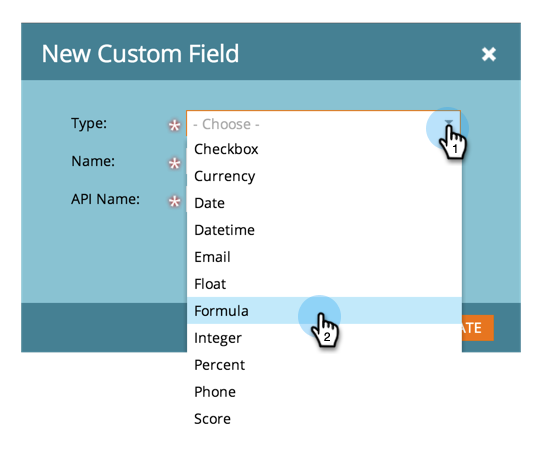

# Een samengevoegd veld String (Formule) maken en gebruiken {#create-and-use-a-concatenated-string-formula-field}

U kunt waarden van meerdere velden combineren of een voorwaardelijke waarde maken met een Marketo Engage-formuleringsveld.

1. Ga naar het **[!UICONTROL Admin]** -gebied.

   

1. Klik op **[!UICONTROL Field Management]**.

   

1. Klik op **[!UICONTROL New Custom Field]**.

   

1. Selecteer **[!UICONTROL Formula]** voor **[!UICONTROL Type]** .

   

1. Voer een **[!UICONTROL Name]** voor uw veld in en klik op **[!UICONTROL Create]** .

   

1. Zoek en selecteer het gewenste veld en klik op **[!UICONTROL Edit Rules]** .

   

1. Voeg twee keuzen toe en definieer deze zoals in de onderstaande schermafbeelding.

   

   >[!TIP]
   >
   >Leer meer over [ tekenen voor stroomstappen ](/help/marketo/product-docs/core-marketo-concepts/smart-campaigns/flow-actions/use-tokens-in-flow-steps.md).

1. Nu kunt u het formules gebied als teken in een e-mail toevoegen.

   

>[!NOTE]
>
>Formulervelden kunnen worden gebruikt in Landingspagina&#39;s, e-mails en kolommen Slimme lijst. E-mails met formules kunnen __ niet worden verzonden gebruikend een partijcampagne. Gelieve te gebruiken een [ symbolisch e-mailmanuscript ](/help/marketo/product-docs/email-marketing/general/using-tokens/create-an-email-script-token.md) in dit scenario.

Goed werk! Nu heb je een slim veld dat weet welke aanhef je moet opnemen op basis van geslacht. Maak hier plezier mee en maak creatief.
