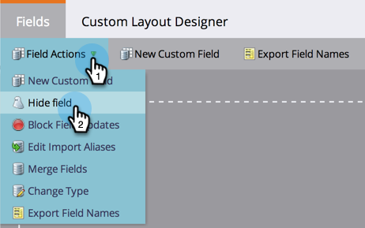

# Een aangepast veld in Marketo verwijderen {#delete-a-custom-field-in-marketo}

>[!NOTE]
>
>**Beheerdersmachtigingen vereist**

U kunt een veld dat u in het verleden hebt gemaakt, verwijderen als u er geen gebruik van meer hebt. Helaas kun je geen velden verwijderen in Marketo, maar je _kan_ ze verbergen in de gebruikersinterface.

1. In **Beheer**, ga naar **Veldbeheer** en selecteert u het veld. Klik in de vervolgkeuzelijst Veldhandelingen op **Veld verbergen**.

   

   Voor gedetailleerde stapsgewijze instructies raadpleegt u [Een veld verbergen en verbergen](/help/marketo/product-docs/administration/field-management/hide-and-unhide-a-field.md).
