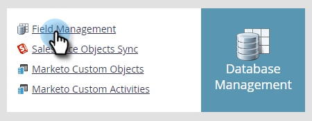

# Exporteren gebruikt door gegevens voor een veld {#export-used-by-data-for-a-field}

Als Admin, hebt u de capaciteit om verwante activa van een gebied uit te voeren zodat kunt u hun delinking aan uw team delegeren.

>[!NOTE]
>
>**Beheerdersmachtigingen vereist**

1. Klik **Admin**.

   

1. Klik **Veld beheren**.

   

1. Zoek het gewenste veld en selecteer het.

   

1. Klik op de vervolgkeuzelijst **Veldhandelingen** en selecteer **Exporteren Gebruikt door**.

   

1. Een Excel-bestand wordt geëxporteerd. Open het bestand om de inhoud ervan weer te geven.

   

   >[!TIP]
   >
   >Elk verwant element is een koppeling waarop kan worden geklikt en die in Marketo wordt geopend.
