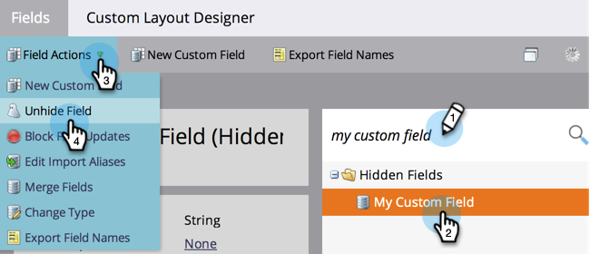

# Een veld verbergen en verbergen opheffen {#hide-and-unhide-a-field}

Als u een veld in Marketo Engage niet meer gebruikt, kunt u het verbergen in de gebruikersinterface zodat het niet meer wordt weergegeven in de toepassing.

## Een veld verbergen {#hide-a-field}

>[!NOTE]
>
>**Vereiste Bevoegdheden Admin**

1. Ga naar het **[!UICONTROL Admin]** -gebied.

   

1. Klik op **[!UICONTROL Field Management]**.

   

1. Zoek het veld, selecteer het en klik vervolgens onder **[!UICONTROL Field Actions]** klikken **[!UICONTROL Hide Field]** .

   

   >[!NOTE]
   >
   >* Als u een veld wilt verbergen, mag het niet worden gekoppeld aan andere elementen (inclusief gearchiveerde elementen). Zorg ervoor dat u het veld uit alle slimme lijsten, keuzemogelijkheden voor stroomstappen, formulieren, e-mails enzovoort verwijdert voordat u het veld verbergt.
   >* U kunt standaardvelden (systeemvelden) niet verbergen.
   >* U kunt de velden voor opportuniteitsinformatie niet verbergen.

1. Klik op **[!UICONTROL Hide]** om te bevestigen.

   

   Mooi werk! Nu weet u hoe u een veld kunt verbergen in de gebruikersinterface van Marketo.

   

## De verbergen van een veld ongedaan maken {#unhide-a-field}

1. Ga naar het **[!UICONTROL Admin]** -gebied.

   

1. Klik op **[!UICONTROL Field Management]**.

   

1. Het veld zoeken en selecteren. Klik in de vervolgkeuzelijst [!UICONTROL Field Actions] op **[!UICONTROL Unhide Field]** .

   

   Geweldig werk! Nu weet u hoe u velden kunt ontgrendelen en opnieuw zichtbaar kunt maken.
