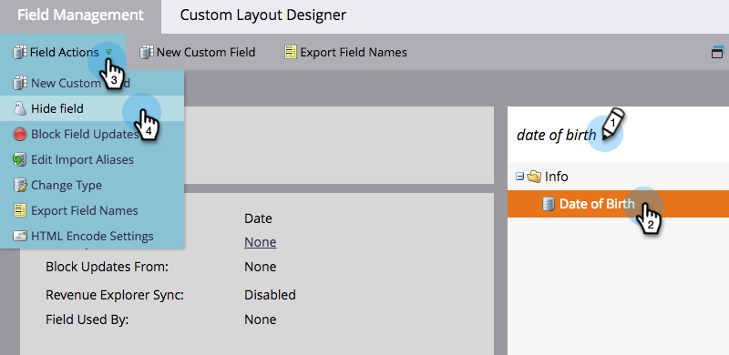

# Een veld verbergen en verbergen opheffen {#hide-and-unhide-a-field}

Als u een veld in Marketo niet meer gebruikt, kunt u het verbergen in de gebruikersinterface zodat het niet meer wordt weergegeven in de toepassing.

## Een veld verbergen {#hide-a-field}

>[!NOTE]
>
>**Beheerdersmachtigingen vereist**

1. Ga naar de **Beheer** gebied.

   

1. Klikken **Veldbeheer**.

   

1. Zoek het veld, selecteer het vervolgens onder **Veldhandelingen** klikken **Veld verbergen**.

   

   >[!NOTE]
   >
   >Als u een veld wilt verbergen, mag het niet worden gekoppeld aan andere elementen (inclusief gearchiveerde elementen). Verwijder het veld uit alle slimme lijsten, stapsgewijze keuzes, formulieren, e-mails enzovoort voordat u het verbergt.

1. Klikken **Verbergen** ter bevestiging.

   

   Mooi werk! Nu weet u hoe u een veld kunt verbergen in de gebruikersinterface van Marketo.

   

## De verbergen van een veld ongedaan maken {#unhide-a-field}

1. Ga naar de **Beheer** gebied.

   

1. Klikken **Veldbeheer**.

   

1. Het veld zoeken en selecteren. Klik in de vervolgkeuzelijst Veldhandelingen op **Veld verbergen**.

   

   Geweldig werk! Nu weet u hoe u de velden kunt verbergen en weer zichtbaar kunt maken in de gebruikersinterface van Marketo.

   >[!TIP]
   >
   >Wilt u dat een massa voor verbergen/verbergen wordt uitgevoerd? Contact opnemen met Marketo Professional Services: services@marketo.com.
