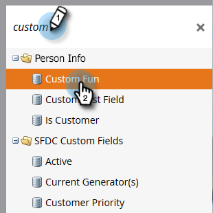

# HTML Encode Tokens in e-mails {#html-encode-tokens-in-emails}

Tokens voor personen en bedrijven die in e-mailberichten worden gebruikt, in- en uitschakelen.

>[!NOTE]
>
>**Vereiste Bevoegdheden Admin**

>[!NOTE]
>
>Bij codering worden tekens omgezet in de HTML-codeversies om te voorkomen dat er verwarring ontstaat wanneer tekens worden verzonden (&quot;&amp;&quot; wordt dus gewijzigd in `&amp;`). Raadpleeg uw webontwikkelaar voor meer informatie.

1. Ga naar het **[!UICONTROL Admin]** -gebied.

   

1. Klik op **[!UICONTROL Field Management]**.

   

1. Selecteer het gewenste veld.

   

1. Schakel het selectievakje **[!UICONTROL HTML Encode Tokens in Emails]** in om in te schakelen, schakel het selectievakje uit om het uit te schakelen.

   

   En dat is het! U kunt dat voor zoveel afzonderlijke velden doen als u wilt.
