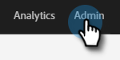

# Een veld markeren als gevoelig {#mark-a-field-as-sensitive}

Als Marketo-beheerder kunt u een bepaald veld als &#39;gevoelig&#39; markeren, zodat de waarden ervan nooit vooraf in formulieren worden ingevuld, waardoor de vertrouwelijke gegevens van gebruikers worden beschermd.

>[!NOTE]
>
>Deze functie wordt ingeschakeld voor alle Marketo-instanties op de avond van dinsdag 11 mei.

1. Klik op **[!UICONTROL Admin]**.

   

1. Klik op **[!UICONTROL Field Management]**.

   

1. Selecteer het gewenste veld.

   

1. Schakel het selectievakje **[!UICONTROL Mark Field as Sensitive]** in.

   

En dat is het! In Marketo-formulieren die vooraf zijn ingevuld, worden geen gegevens voor het geselecteerde veld weergegeven.
