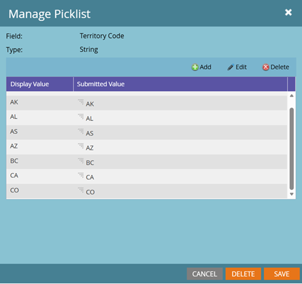

# Picklist-beheer {#picklist-management}

Met Picklist-beheer kunt u een vaste set waarden definiëren voor een veld om gegevens- en workflowbeheer in Marketo Engage te vereenvoudigen. Alleen niet-tekstvelden die niet zijn toegewezen aan een CRM-veld met een gedefinieerde keuzelijst, kunnen in Marketo worden beheerd. Als een veld wordt toegewezen aan een CRM-veld met een gedefinieerde keuzelijst, moeten de waarden voor dat veld worden gedefinieerd in de CRM.

U kunt de status van een keuzelijst bekijken op de pagina Veld beheren. Een veld kan een van de volgende statussen voor keuzelijsten hebben:

* **Beheerd**: Een gebruiker heeft de reeks waarden bepaald die voor dit gebied kan worden autoproposed. Alleen waarden die zijn gedefinieerd in veldbeheer worden automatisch voorgesteld. Als een beheerde picklist wordt geschrapt, keert de picklist status aan de aanvankelijke waarde voor het gebied terug, of Unmanaged of Gezaaid.

* **Unmanaged**: De mogelijke waarden voor dit gebied worden niet bepaald. Waarden worden automatisch voorgesteld op basis van waarden die in die velden in de database voorkomen.

* **Gezacht**: Het gebied heeft een systeem-bepaalde lijst van waarden die aan de gebruiker worden gesuggereerd.

* **CRM**: Het gebied heeft waarde die door het systeem van CRM, Salesforce.com of Microsoft Dynamics wordt bepaald, dat aan de instantie wordt gesynchroniseerd.

  

## Picklist beheren {#manage-picklist}

Om de waarden voor een gebied te wijzigen, ga **Admin** > **het Beheer van het Gebied** en selecteer het gewenste gebied.

Klik de _drop-down Acties van het Gebied_ en selecteer **Beheren Picklist**.

In het _leidt de dialoog van de Bestelwagen_ u, waarden toevoegen uitgeven of schrappen. U kunt beheerde picklist ook schrappen om het gebied aan zijn originele picklist status terug te keren, of _Unmanaged_ of _Gewenst_.

Elk keuzelijstitem heeft een weergavewaarde en een verzendwaarde. De waarde van de Vertoning is wat aan de gebruiker wordt gesuggereerd wanneer het bouwen van Slimme Lijsten, Slimme Campagnes, of vormen, terwijl de voorgelegde waarde wordt opgeslagen. Zo kunt u met de praktijkzaak van uw Territoriale Code de volledige naam van een gebied (bijvoorbeeld Alberta) voorstellen, terwijl de tweelettercode (AB) wordt opgeslagen.

## Automatisch voorstellen {#autosuggest}

Wanneer het _Beheerde plaatsen van de Beheerde Bestellijst_ wordt toegelaten, zullen de Filters, de Keuzen van de Stap van de Stroom, en de stappen van de Waarde van Gegevens van de Verandering waarden van uw beheerde picklist autosuggereren. Als deze instelling is uitgeschakeld, worden alleen onbeheerde waarden voorgesteld.

### Schakelen tussen Beheerde en Onbeheerde Picklists {#switching}

De meeste Marketo Engage-abonnementen bevatten gegevens van vóór de introductie van Beheerde Picklists. Om waarden in slimme lijsten of stroomstappen van deze onbeheerde versiekiezenlijst (b.v., van de volledige reeks waarden te gebruiken die op verslagen in uw gegevensbestand) bestaan, knevel de Beheerde het plaatsen van de Beheerde Beheerde Bestelwagen in uw Slimme Lijst of de mening van de Campagne. Wanneer van een knevel voorzien, slechts worden de beheerde picklist waarden getoond. Wanneer van een knevel voorzien, wordt unmanaged picklist gebruikt en de waarden worden automatisch voorgesteld gebaseerd op bestaande waarden in het gegevensbestand.

## Formulierkiezers (tekstvelden selecteren) {#form-picklists}

Als Gezaaid en CRM-Beheerde picklists, verspreiden de waarden voor Beheerde Picklists zich in Forms wanneer het gebruiken van het Uitgezochte gebiedstype. Voor een gebied met een beheerde picklist, selecteer dat gebied en plaats het Type van Gebied aan _Uitgezocht_.

Dit toont de reeks beheerde picklist waarden die voor dat gebied worden bepaald.

