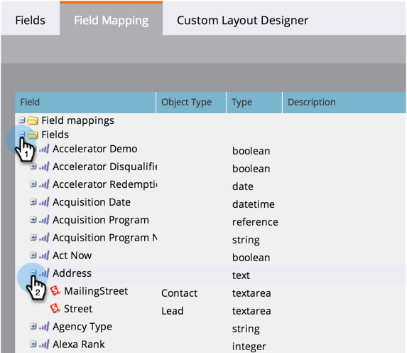

# Veldtoewijzingen weergeven tussen Marketo en Salesforce {#view-field-mappings-between-marketo-and-salesforce}

Mogelijk wilt u weten aan welke Salesforce-velden een specifiek Marketo-veld is gekoppeld. Dit is hoe je dit kunt bereiken.

>[!NOTE]
>
>**Beheerdersmachtigingen vereist**

1. Ga naar **Admin** en klik **Veld Management**.

   

1. Zoek het gebied u in het zien geinteresseerd bent en klik **+** om de afbeelding uit te breiden.

   

>[!NOTE]
>
>Hier wordt de naam van de Salesforce-API weergegeven, niet de naam van een label.

Mooi werk! U weet nu hoe u kunt zien aan welke Salesforce-velden je Marketo-velden zijn gekoppeld.
