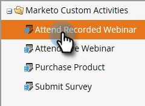
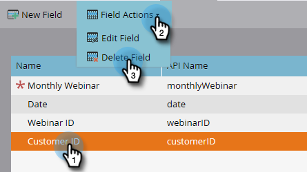

# Aangepaste activiteitsvelden van Marketo toevoegen/bewerken/verwijderen {#add-edit-delete-marketo-custom-activity-fields}

Mogelijk moet u een aangepast activiteitsveld toevoegen, wijzigen of zelfs verwijderen. Zo gaat het.

## Een veld Aangepaste activiteit toevoegen {#add-a-custom-activity-field}

1. Ga naar het **[!UICONTROL Admin]** -gebied.

   

1. Klik op **[!UICONTROL Marketo Custom Activities]**.

   

1. Klik op **[!UICONTROL Fields]**.

   

1. Selecteer de aangepaste activiteit waaraan u een veld wilt toevoegen.

   

1. Klik op **[!UICONTROL New Field]**.

   

1. Kies de velden [!UICONTROL data type] .

   

   >[!TIP]
   >
   >Weet u niet zeker wat u moet selecteren? We hebben je bedekt! Alle beschikbare gegevenstypes worden bepaald in [&#x200B; dit artikel &#x200B;](/help/marketo/product-docs/administration/field-management/custom-field-type-glossary.md).

1. Geef het veld een naam. De api-naam wordt automatisch ingevuld. Klik op **[!UICONTROL Save]** als u klaar bent.

   

   Dat is het! Uw nieuwe veld is toegevoegd.

## Een veld Aangepaste activiteit bewerken {#edit-a-custom-activity-field}

1. Ga naar het **[!UICONTROL Admin]** -gebied.

   

1. Klik op **[!UICONTROL Marketo Custom Activities]**.

   

1. Klik op **[!UICONTROL Fields]**.

   

1. Selecteer de aangepaste activiteit die het veld bevat dat u wilt bewerken.

   

1. Selecteer het veld dat u wilt bewerken, klik op de vervolgkeuzelijst **[!UICONTROL Field Actions]** en selecteer **[!UICONTROL Edit Field]** .

   

   Het pop-upvenster **[!UICONTROL Edit Field]** wordt weergegeven. In dit voorbeeld wijzigen we de naam van het veld.

   

1. Voer de nieuwe naam en Api-naam in en klik op **[!UICONTROL Save]** .

   

   >[!NOTE]
   >
   >De lus [!UICONTROL Api Name] wordt niet automatisch gevuld wanneer u een veld bewerkt. Hoewel het niet nodig is dat het veld [!UICONTROL Name] en [!UICONTROL Api Name] overeenkomen, raden we u aan dit alsnog te doen.

   >[!CAUTION]
   >
   >U kunt de Api-naam alleen bewerken of het veld wijzigen in Primair als de aangepaste activiteit nog niet is gepubliceerd.

   >[!NOTE]
   >
   >Als u het veld Primair wilt wijzigen, moet u eerst de bestaande optie uitschakelen.

Uw veld wordt nu bewerkt.

## Een aangepast activiteitsveld verwijderen {#delete-a-custom-activity-field}

1. Ga naar het **[!UICONTROL Admin]** -gebied.

   

1. Klik op **[!UICONTROL Marketo Custom Activities]**.

   

1. Klik op **[!UICONTROL Fields]**.

   

1. Selecteer de aangepaste activiteit die het veld bevat dat u wilt verwijderen.

   

1. Selecteer het veld dat u wilt verwijderen, klik op de vervolgkeuzelijst **[!UICONTROL Field Actions]** en selecteer **[!UICONTROL Delete Field]** .

   
