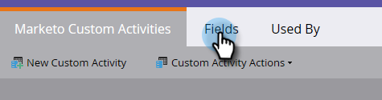

# Aangepaste activiteitsvelden voor Marketo toevoegen/bewerken/verwijderen {#add-edit-delete-marketo-custom-activity-fields}

Mogelijk moet u een aangepast activiteitsveld toevoegen, wijzigen of zelfs verwijderen. Zo gaat het.

## Een aangepast activiteitsveld toevoegen {#add-a-custom-activity-field}

1. In de Activiteiten van de Douane van Marketo, klik **Gebieden**.

   

1. Selecteer de aangepaste activiteit waaraan u een veld wilt toevoegen.

   

1. Klik **Nieuw veld**.

   

1. Kies het gegevenstype van het veld.

   

   >[!TIP]
   >
   >Weet u niet zeker wat u moet selecteren? We hebben je bedekt! Alle beschikbare gegevenstypen worden gedefinieerd in [dit artikel](/help/marketo/product-docs/administration/field-management/custom-field-type-glossary.md).

1. Geef het veld een naam. De api-naam wordt automatisch ingevuld. Wanneer u wordt gedaan, klik **sparen**.

   

   Dat is het! Uw nieuwe veld is toegevoegd.

## Een aangepast activiteitsveld bewerken {#edit-a-custom-activity-field}

1. In de Activiteiten van de Douane van Marketo, klik **Gebieden**.

   

1. Selecteer de aangepaste activiteit die het veld bevat dat u wilt bewerken.

   

1. Selecteer het veld dat u wilt bewerken, klik op de vervolgkeuzelijst **Veldhandelingen** en selecteer **Veld bewerken**.

   

   Het pop-upvenster Veld bewerken wordt weergegeven. In dit voorbeeld wijzigen we de naam van het veld.

   

1. Voer de nieuwe naam en Api-naam in en klik op **Opslaan**.

   

   >[!NOTE]
   >
   >De API-naam wordt niet automatisch ingevuld wanneer u een veld bewerkt. Hoewel het niet wordt vereist dat de Naam van het Gebied en de Naam van Api aanpassen, adviseren wij zij.

   >[!CAUTION]
   >
   >U kunt de Api-naam alleen bewerken of het veld wijzigen in Primair als de aangepaste activiteit nog niet is gepubliceerd. Als de activiteit reeds is gepubliceerd, kunt u de naam van het gebied en facultatieve beschrijving slechts uitgeven.

   >[!NOTE]
   >
   >Als u het veld Primair wilt wijzigen, moet u eerst de bestaande optie uitschakelen.

Uw veld wordt nu bewerkt.

## Een aangepast activiteitsveld {#delete-a-custom-activity-field} verwijderen

1. In de Activiteiten van de Douane van Marketo, klik **Gebieden**.

   

1. Selecteer de aangepaste activiteit die het veld bevat dat u wilt verwijderen.

   

1. Selecteer het veld dat u wilt verwijderen, klik op de vervolgkeuzelijst **Veldhandelingen** en selecteer **Veld verwijderen**.

   

   Het is gewoon zo gemakkelijk!
