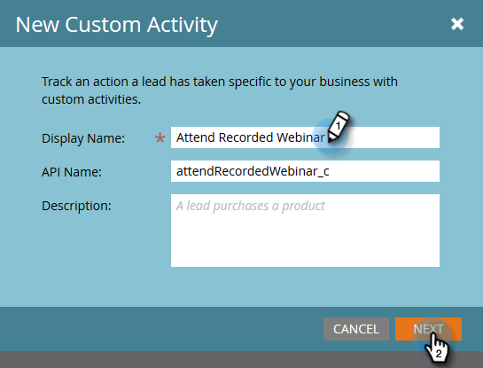

# Een aangepaste activiteit maken {#create-a-custom-activity}

Ga als volgt te werk om een nieuwe aangepaste activiteit te maken.

>[!NOTE]
>
>De meeste abonnementen hebben een toegewezen limiet van 10 soorten aangepaste activiteiten.

1. Ga naar het **[!UICONTROL Admin]** -gebied.

   

1. Klik op **[!UICONTROL Marketo Custom Activities]**.

   

1. Klik op **[!UICONTROL New Custom Activity]**.

   

1. Voer een naam en optioneel [!UICONTROL Description] in en klik op **[!UICONTROL Next]** . De API-naam wordt automatisch ingevuld, maar kan worden aangepast.

   

   >[!CAUTION]
   >
   >Als u besluit om [!UICONTROL API Name] te wijzigen, moet u ervoor zorgen dat de naam geen conflict veroorzaakt met velden in andere aangepaste activiteiten.

1. Definieer de [!UICONTROL Filter] en [!UICONTROL Trigger] en klik op **[!UICONTROL Next]** .

   

1. Geef uw primaire veld een **[!UICONTROL Name]** waarin wordt samengevat waarvoor de aangepaste activiteit is bedoeld.

   

>[!MORELIKETHIS]
>
>[&#x200B; Begrijpend de Activiteiten van de Douane &#x200B;](/help/marketo/product-docs/administration/marketo-custom-activities/understanding-custom-activities.md)
