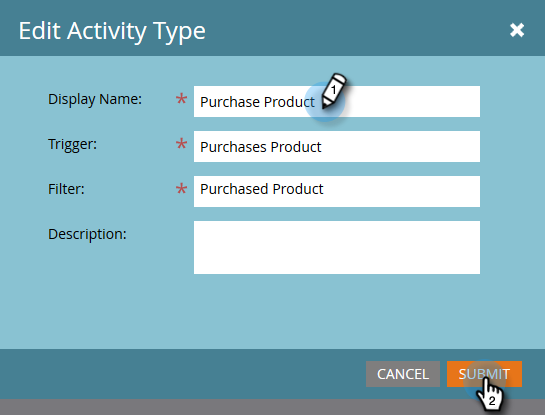

# Een aangepaste activiteit bewerken {#edit-a-custom-activity}

Wilt u wijzigingen aanbrengen in een aangepaste activiteit die u al hebt gemaakt? Zo gaat het.

1. Ga naar de **Beheer** gebied.

   

1. Klikken **Aangepaste Marketo-activiteiten**.

   

1. Selecteer de aangepaste activiteit die u wilt bewerken.

   

1. Klikken **Acties voor aangepaste activiteiten** en selecteert u **Activiteit bewerken**.

   

   Type activiteit bewerken wordt weergegeven. In dit voorbeeld repareren we een typefout.

   

1. Voer uw nieuwe gegevens in en klik op **Verzenden**.

   

   Je aangepaste activiteit wordt nu bewerkt.

   >[!NOTE]
   >
   >Als uw activiteit een concept was op het moment van bewerking, blijft het een concept. Als deze is gepubliceerd, verandert de status in Gepubliceerd met concept.
