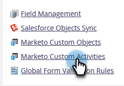
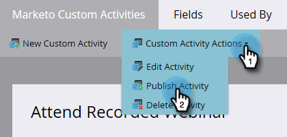

# Een aangepaste activiteit publiceren {#publish-a-custom-activity}

Je hebt je aangepaste activiteit precies zoals je die wilt. Nu is het tijd om het te publiceren!

1. Ga naar het **[!UICONTROL Admin]** -gebied.

   

1. Klik op **[!UICONTROL Marketo Custom Activities]**.

   

1. Selecteer de aangepaste activiteit die u wilt publiceren.

   

1. Klik op de vervolgkeuzelijst **[!UICONTROL Custom Activity Actions]** en selecteer **[!UICONTROL Publish Activity]** .

   

   De aangepaste activiteit [!UICONTROL state] gaat van [!UICONTROL Draft] ...

   

   ...tot [!UICONTROL Published] .

   

   Echt waar!
