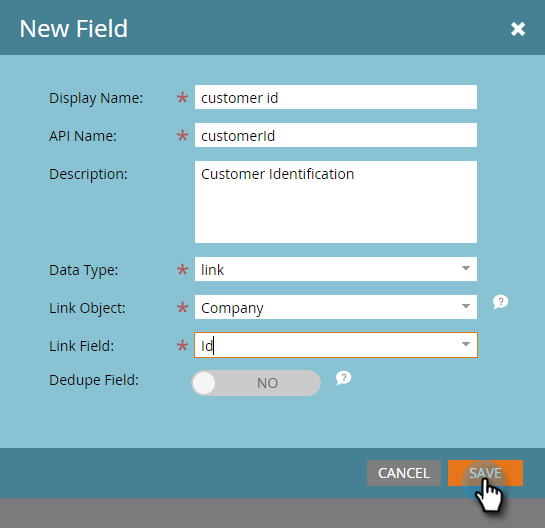

# Aangepaste Marketo-objectkoppelingsvelden toevoegen {#add-marketo-custom-object-link-fields}

Wanneer u aangepaste objecten maakt, moet u koppelingsvelden opgeven om de aangepaste objectreeks te koppelen aan de juiste bovenliggende record.

* Voor een één-op-vele douanestructuur, gebruik het verbindingsgebied in het douanevoorwerp om het met een persoon of een bedrijf te verbinden.
* Voor een vele-aan-vele structuur, gebruikt u twee verbindingsgebieden, die van een afzonderlijk gecreeerd intermediair voorwerp worden verbonden (dat een type van douanevoorwerp, ook is). Eén koppeling maakt verbinding met personen of bedrijven in uw database en de andere koppeling maakt verbinding met het aangepaste object. In dit geval bevindt het koppelingsveld zich niet in het aangepaste object zelf.

>[!IMPORTANT]
>
>Marketo Engage ondersteunt slechts één randobject voor elk bridge-object in de relatie tussen Velen en Velen. In het onderstaande voorbeeld kan elke inschrijving slechts aan één cursus worden gekoppeld. Nochtans, kunnen er vele brugvoorwerpen voor elk randvoorwerp zijn, enkel aangezien er vele studenteninschrijvingen aan elke cursus (vaak-aan-Één verhouding) zijn. Als u de gegevens van uw aangepaste objecten zodanig hebt gestructureerd dat er meer dan één Edge-objectrecord is voor elke Bridge-objectrecord (een-op-een-veel of een-op-veel), kunt u meerdere Bridge-objectrecords maken die elk naar één Edge-objectrecord verwijzen om die gegevens in Marketo te vertegenwoordigen.

## Een koppelingsveld maken voor een structuur van één tot vele {#create-a-link-field-for-a-one-to-many-structure}

Hieronder wordt beschreven hoe u een koppelingsveld maakt in een aangepast object voor een een-op-een-structuur.

1. Ga naar het **[!UICONTROL Admin]** -gebied.

   

1. Klik op **[!UICONTROL Marketo Custom Objects]**.

   

1. Selecteer het aangepaste object in de lijst.

   

1. Klik op het tabblad **[!UICONTROL Fields]** op **[!UICONTROL New Field]** .

   

1. Geef het koppelingsveld een naam en voeg een optioneel veld toe [!UICONTROL Description] . Selecteer het gegevenstype [!UICONTROL Link] .

   

   >[!CAUTION]
   >
   >U kunt niet terug gaan en een [!UICONTROL Link] of [!UICONTROL Dedupe Field] maken, bewerken of verwijderen als het aangepaste object is goedgekeurd.

1. Selecteer of de [!UICONTROL Link Object] voor een [!UICONTROL lead] (persoon) of een [!UICONTROL company] is.

   

   >[!NOTE]
   >
   >Als u [!UICONTROL lead] kiest, ziet u Id, e-mailadres en eventuele aangepaste velden in de lijst.
   >
   >Als u [!UICONTROL company] kiest, ziet u Id en eventuele aangepaste velden in de lijst.

1. Selecteer de [!UICONTROL Link Field] waarmee u verbinding wilt maken als het bovenliggende element van het nieuwe veld.

   

   >[!NOTE]
   >
   >Alleen tekenreeksveldtypen worden ondersteund in de [!UICONTROL Link Field] .

1. Klik op **[!UICONTROL Save]**.

   

## Maak een koppelingsveld voor een veel-op-veel-structuur {#create-a-link-field-for-a-many-to-many-structure}

Hier is hoe te om een verbindingsgebied in een intermediair voorwerp voor gebruik in een vele-aan-vele structuur tot stand te brengen.

>[!PREREQUISITES]
>
>U moet het intermediaire object al hebben gemaakt en alle aangepaste objecten die u wilt koppelen.

1. Ga naar het **[!UICONTROL Admin]** -gebied.

   

1. Klik op **[!UICONTROL Marketo Custom Objects]**.

   

1. Selecteer het intermediaire object waaraan u het veld wilt toevoegen.

   

1. Klik op het tabblad **[!UICONTROL Fields]** op **[!UICONTROL New Field]** .

   

1. U moet twee koppelingsvelden maken. Maak ze een voor een. Geef eerst het veld een naam voor de leden van de databaselijst (bijvoorbeeld leadID). Voeg een optionele [!UICONTROL Description] toe. Selecteer de [!UICONTROL link] [!UICONTROL Data Type] .

   

   >[!CAUTION]
   >
   >U kunt niet terug gaan en een [!UICONTROL Link] of [!UICONTROL Dedupe Field] maken, bewerken of verwijderen als het aangepaste object is goedgekeurd.

1. Selecteer [!UICONTROL Link Object] in de database; in dit geval [!UICONTROL Lead] .

   

1. Selecteer de [!UICONTROL Link Field] waarmee u verbinding wilt maken, in dit geval [!UICONTROL Id] .

   

   >[!NOTE]
   >
   >Alleen tekenreeksveldtypen worden ondersteund in de [!UICONTROL Link Field] .

1. Klik op **[!UICONTROL Save]**.

   

1. Herhaal dit proces voor de tweede koppeling naar uw aangepaste object, in dit voorbeeld, cursusID. De naam van [!UICONTROL Link Object] is een cursus en de naam van [!UICONTROL Link Field] is een cursusID. Aangezien u het aangepaste cursusobject al hebt gemaakt en goedgekeurd, zijn deze selecties beschikbaar in de vervolgkeuzemenu&#39;s.

   

1. Maak andere velden die u in het intermediaire object wilt gebruiken, zoals inschrijvers-id of rang.

## Aangepaste objecten gebruiken {#using-custom-objects}

De volgende stap bestaat uit het gebruik van deze aangepaste objecten in filters in slimme campagnes. Met een vele-aan-vele verhouding, kunt u veelvoudige mensen/bedrijven en veelvoudige douanevoorwerpen selecteren. In het onderstaande voorbeeld wordt iedereen in de database vermeld die aan deze criteria voldoet. Het cursusnaamveld is afkomstig van het aangepaste cursusobject en de inschrijvingskwaliteit is afkomstig van het tussenliggende object.

>[!MORELIKETHIS]
>
>* [&#x200B; voeg de Gebieden van de Objecten van Marketo toe &#x200B;](/help/marketo/product-docs/administration/marketo-custom-objects/add-marketo-custom-object-fields.md)
>* [&#x200B; geef uit en schrap een Voorwerp van de Douane van Marketo &#x200B;](/help/marketo/product-docs/administration/marketo-custom-objects/edit-and-delete-a-marketo-custom-object.md)
>* [&#x200B; Begrijpend de douanevoorwerpen van Marketo &#x200B;](/help/marketo/product-docs/administration/marketo-custom-objects/understanding-marketo-custom-objects.md)
>* [&#x200B; geef uit en schrap de Gebieden van de Objecten van de Douane van Marketo &#x200B;](/help/marketo/product-docs/administration/marketo-custom-objects/edit-and-delete-marketo-custom-object-fields.md) uit
