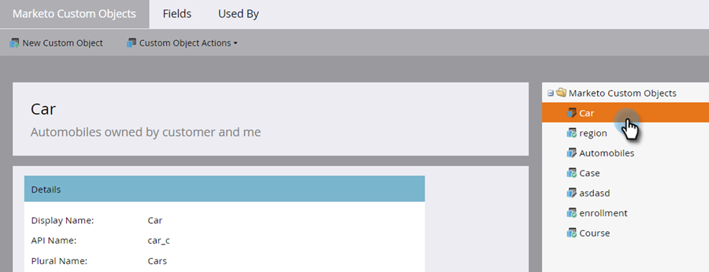
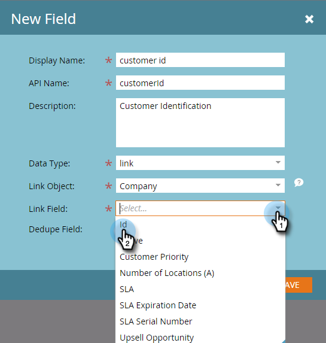
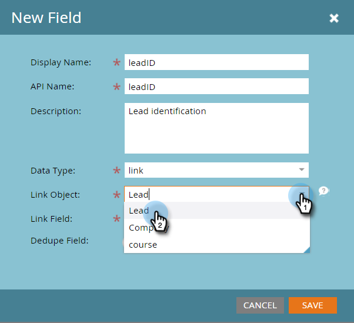
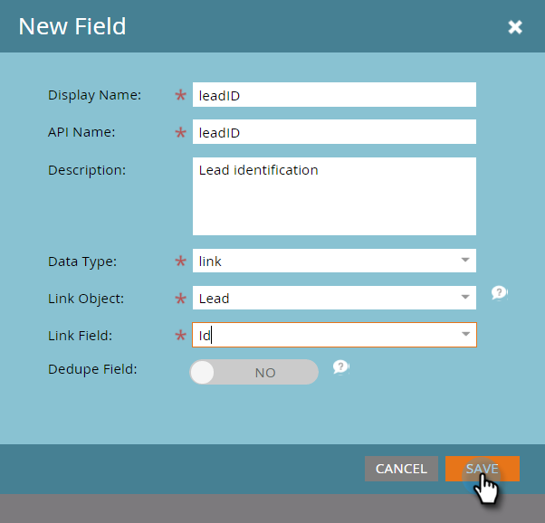

# Aangepaste Marketo-objectkoppelingsvelden toevoegen {#add-marketo-custom-object-link-fields}

Wanneer u aangepaste objecten maakt, moet u koppelingsvelden opgeven om de aangepaste objectreeks te koppelen aan de juiste bovenliggende record.

* Voor een één-op-vele douanestructuur, gebruik het verbindingsgebied in het douanevoorwerp om het met een persoon of een bedrijf te verbinden.
* Voor een vele-aan-vele structuur, gebruikt u twee verbindingsgebieden, die van een afzonderlijk gecreeerd intermediair voorwerp worden verbonden (dat een type van douanevoorwerp, ook is). Eén koppeling maakt verbinding met personen of bedrijven in uw database en de andere koppeling maakt verbinding met het aangepaste object. In dit geval bevindt het koppelingsveld zich niet in het aangepaste object zelf.

## Een koppelingsveld maken voor een structuur van één tot vele {#create-a-link-field-for-a-one-to-many-structure}

Hieronder wordt beschreven hoe u een koppelingsveld maakt in een aangepast object voor een een-op-een-structuur.

1. Ga naar de **[!UICONTROL Admin]** gebied.

   

1. Klik op **[!UICONTROL Marketo Custom Objects]**.

   

1. Selecteer het aangepaste object in de lijst.

   

1. In de **[!UICONTROL Fields]** tabblad, klikt u op **[!UICONTROL New Field]**.

   

1. Geef het koppelingsveld een naam en voeg een optioneel veld toe [!UICONTROL Description]. Zorg ervoor dat u de [!UICONTROL Link] gegevenstype.

   

   >[!CAUTION]
   >
   >U kunt niet teruggaan om een [!UICONTROL Link] of [!UICONTROL Dedupe Field] nadat het aangepaste object is goedgekeurd.

1. Selecteer of [!UICONTROL Link Object] is voor een [!UICONTROL lead] (persoon) of [!UICONTROL company].

   

   >[!NOTE]
   >
   >Als u [!UICONTROL lead], ziet u Id, e-mailadres en eventuele aangepaste velden in de lijst.
   >
   >Als u [!UICONTROL company], ziet u Id en eventuele aangepaste velden in de lijst.

1. Selecteer [!UICONTROL Link Field] Als u verbinding wilt maken met het bovenliggende element van het nieuwe veld.

   

   >[!NOTE]
   >
   >Alleen typen tekenreeksvelden worden ondersteund in het koppelingsveld.

1. Klik op **[!UICONTROL Save]**.

   

## Creeer een Gebied van de Verbinding voor een Vele-aan-Vele Structuur {#create-a-link-field-for-a-many-to-many-structure}

Hier is hoe te om een verbindingsgebied in een intermediair voorwerp voor gebruik in een vele-aan-vele structuur tot stand te brengen.

>[!PREREQUISITES]
>
>U moet het intermediaire object al hebben gemaakt en alle aangepaste objecten die u wilt koppelen.

1. Ga naar de **[!UICONTROL Admin]** gebied.

   

1. Klik op **[!UICONTROL Marketo Custom Objects]**.

   

1. Selecteer het intermediaire object waaraan u het veld wilt toevoegen.

   

1. In de **[!UICONTROL Fields]** tabblad, klikt u op **[!UICONTROL New Field]**.

   

1. U moet twee koppelingsvelden maken. Maak ze een voor een. Geef eerst het veld een naam voor de leden van de databaselijst (bijvoorbeeld leadID). Een optioneel object toevoegen [!UICONTROL Description]. Zorg ervoor dat u de [!UICONTROL link] [!UICONTROL Data Type].

   

   >[!CAUTION]
   >
   >U kunt niet teruggaan om een [!UICONTROL Link] of [!UICONTROL Dedupe Field] nadat het aangepaste object is goedgekeurd.

1. Selecteer [!UICONTROL Link Object] uit uw database; in dit geval [!UICONTROL Lead].

   

1. Selecteer [!UICONTROL Link Field] u wilt in dit geval verbinding maken met [!UICONTROL Id].

   

   >[!NOTE]
   >
   >Alleen tekenreeksveldtypen worden ondersteund in het dialoogvenster [!UICONTROL Link Field].

1. Klik op **[!UICONTROL Save]**.

   

1. Herhaal dit proces voor de tweede koppeling naar uw aangepaste object, in dit voorbeeld, cursusID. De [!UICONTROL Link Object] de naam is een cursus en de [!UICONTROL Link Field] wordt cursusnummer. Aangezien u het aangepaste cursusobject al hebt gemaakt en goedgekeurd, zijn deze selecties beschikbaar in de vervolgkeuzemenu&#39;s.

   

1. Maak andere velden die u in het intermediaire object wilt gebruiken, zoals inschrijvers-id of rang.

## Aangepaste objecten gebruiken {#using-custom-objects}

De volgende stap bestaat uit het gebruik van deze aangepaste objecten in filters in slimme campagnes. Met een vele-aan-vele verhouding, kunt u veelvoudige mensen/bedrijven en veelvoudige douanevoorwerpen selecteren. In het onderstaande voorbeeld wordt iedereen in de database vermeld die aan deze criteria voldoet. Het cursusnaamveld is afkomstig van het aangepaste cursusobject en de inschrijvingskwaliteit is afkomstig van het tussenliggende object.

>[!MORELIKETHIS]
>
>* [Aangepaste Marketo-objectvelden toevoegen](/help/marketo/product-docs/administration/marketo-custom-objects/add-marketo-custom-object-fields.md)
>* [Een aangepast Marketo-object bewerken en verwijderen](/help/marketo/product-docs/administration/marketo-custom-objects/edit-and-delete-a-marketo-custom-object.md)
>* [Aangepaste Marketo-objecten begrijpen](/help/marketo/product-docs/administration/marketo-custom-objects/understanding-marketo-custom-objects.md)
>* [Aangepaste Marketo-objectvelden bewerken en verwijderen](/help/marketo/product-docs/administration/marketo-custom-objects/edit-and-delete-marketo-custom-object-fields.md)
