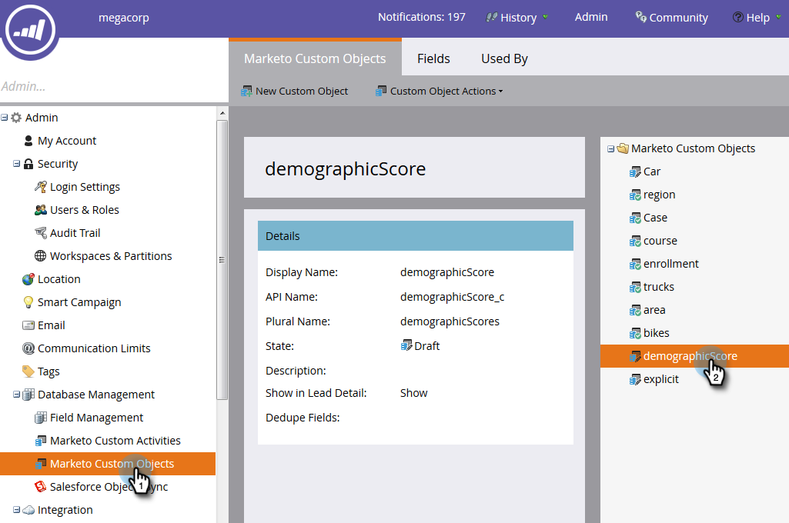

# Een aangepast object {#approve-a-custom-object} goedkeuren

U moet een aangepast object goedkeuren voordat u het kunt gebruiken. Het proces is iets anders voor nieuwe aangepaste objecten en objecten die u hebt bewerkt.

## Een nieuw aangepast object goedkeuren {#approve-a-new-custom-object}

U hebt een gloednieuw aangepast object gemaakt. Hier is hoe je het goedkeurt.

1. Klik in Admin op **Aangepaste objecten van Marketo** en selecteer een object in de status Concept.

   

1. Klik op de vervolgkeuzelijst **Aangepaste objecthandelingen** en selecteer **Object goedkeuren**.

   

1. De status verandert in Goedgekeurd.

   

   >[!NOTE]
   >
   >Een aangepast object dat wordt gebruikt in een _een-op-een-structuur_ moet ten minste één dedupliceerveld, een koppelingsveld, een naam van een gekoppeld object en een gekoppelde veldnaam hebben die moeten worden goedgekeurd.
   >
   >Een aangepast object dat wordt gebruikt in een _veel-naar-veel-structuur_ **heeft geen koppelingsveld, gekoppelde objectnaam of een gekoppelde veldnaam nodig wanneer u het goedkeurt (omdat ze in het intermediaire object leven).**
   >
   >Een douanevoorwerp dat als _intermediair voorwerp_ wordt gebruikt vereist een verbindingsgebied, een verbonden objecten naam, en een verbonden gebiedsnaam maar **vereist geen** een deduplicaatgebied.
   >
   >Zie [Inzicht in aangepaste Marketo-objecten](/help/marketo/product-docs/administration/marketo-custom-objects/understanding-marketo-custom-objects.md) voor meer informatie.

Dat is het! U kunt nu uw aangepaste object selecteren met de beperkingen van de filters en triggers die u in uw campagnes wilt gebruiken.

## Een bewerkt aangepast object {#approve-an-edited-custom-object} goedkeuren

Nadat u een goedgekeurd aangepast object hebt bewerkt, moet u het concept goedkeuren om het aangepaste object terug te brengen naar de status Goedgekeurd.

1. Wanneer u een reeds goedgekeurd douanevoorwerp uitgeeft, ontvangt het een Goedgekeurd met de staat van het Ontwerp.

   

1. Wanneer u bereid bent om het ontwerp goed te keuren, klik **de drop-down Acties van de Objecten van de Douane** en selecteer **goedkeuren Voorwerp**.

   

1. In een voorvertoning worden de gewijzigde items in het concept weergegeven. Klik **Goedkeuren**.

   
