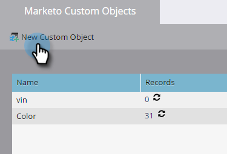
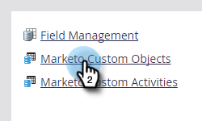

# Aangepaste Marketo-objecten maken {#create-marketo-custom-objects}

Gebruik aangepaste objecten in Marketo om metrische gegevens bij te houden die specifiek zijn voor uw bedrijf. Dit kan van alles zijn, van auto&#39;s tot cursussen, wat u ook in Marketo wilt modelleren om uw campagnes uit te voeren.

>[!NOTE]
>
>U kunt aangepaste objecten zo instellen dat deze werken op een-op-veel- of een-op-veel-basis. U maakt het oorspronkelijke object op dezelfde manier, maar de stappen verschillen wanneer u velden aan het object toevoegt. Zie [ Begrijpend de Voorwerpen van de Douane van Marketo ](/help/marketo/product-docs/administration/marketo-custom-objects/understanding-marketo-custom-objects.md) voor meer informatie.

>[!NOTE]
>
>Als het aangepaste object is goedgekeurd, kunt u geen koppelings- of deduplicatieveld maken, bewerken of verwijderen.

## Een aangepast object maken voor een een-op-een-structuur {#create-a-custom-object-for-a-one-to-many-structure}

In dit voorbeeld ziet u een aangepast object Car voor gebruik in een structuur van één op vele. Later maakt u een aangepast cursusobject en een tussenliggend object voor gebruik in een veel-op-veel-structuur.

1. Ga naar het **[!UICONTROL Admin]** -gebied.

   

1. Klik op **[!UICONTROL Marketo Custom Objects]**.

   

1. Klik op **[!UICONTROL New Custom Object]**.

   

   >[!NOTE]
   >
   >Op het tabblad [!UICONTROL Marketo Custom Objects] worden alle aangepaste objecten aan de rechterkant weergegeven, evenals details voor goedgekeurde objecten, waaronder het aantal records en velden bij de meest recente update.

1. Voer een [!UICONTROL Display Name] in. De tekens [!UICONTROL API Name] en [!UICONTROL Plural Name] worden automatisch ingevuld. Voer een [!UICONTROL Description] (optioneel) in.

   

   >[!NOTE]
   >
   >U kunt deze velden bewerken wanneer u ze maakt, maar nadat ze zijn opgeslagen, kunt u alleen het veld [!UICONTROL Plural Name] en de schuifregelaar **[!UICONTROL Show in Lead Detail]** bewerken.

1. Trek de schuifregelaar **[!UICONTROL Show in Lead Detail]** over om **[!UICONTROL Show]** weer te geven als u aangepaste objectgegevens wilt weergeven op de databasepagina. Klik op **[!UICONTROL Save]**.

   

1. De informatie over aangepaste objecten geeft de inhoud weer die u hebt ingevoerd. Let op: de status is **[!UICONTROL Draft]** .

   

   De volgende stap moet gebieden aan [ toevoegen bouwt uw douanevoorwerp ](/help/marketo/product-docs/administration/marketo-custom-objects/add-marketo-custom-object-fields.md).

   >[!NOTE]
   >
   >U kunt de Voorwerpen van de Douane van Marketo via een lijstinvoer slechts bevolken, of [ API ](https://experienceleague.adobe.com/en/docs/marketo-developer/marketo/rest/rest-api).

## Een aangepast object maken voor een veel-op-veel-structuur {#create-a-custom-object-for-a-many-to-many-structure}

In dit voorbeeld ziet u een aangepast cursusobject dat u kunt gebruiken voor het maken van een vele-op-veel-relatie tussen personen/bedrijven en cursussen. Wanneer u wordt gedaan, zult u een intermediair voorwerp creëren om het met mensen of bedrijven in uw gegevensbestand te verbinden.

>[!NOTE]
>
>Voor een veel-aan-vele verhouding, te hoeven u om geen verbinding in het douanevoorwerp tot stand te brengen. In plaats daarvan voegt u twee koppelingen toe aan het intermediaire object (zie hieronder).

1. Ga naar het **[!UICONTROL Admin]** -gebied.

   

1. Klik op **[!UICONTROL Marketo Custom Objects]**.

   

1. Klik op **[!UICONTROL New Custom Object]**.

   

1. Voer een [!UICONTROL Display Name] in. De tekens [!UICONTROL API Name] en [!UICONTROL Plural Name] worden automatisch ingevuld. Voer een [!UICONTROL Description] (optioneel) in.

   

   >[!NOTE]
   >
   >U kunt deze velden bewerken wanneer u ze maakt, maar nadat ze zijn opgeslagen, kunt u alleen het veld [!UICONTROL Plural Name] en de schuifregelaar **[!UICONTROL Show in Lead Detail]** bewerken.

1. Trek de schuifregelaar **[!UICONTROL Show in Lead Detail]** over om **[!UICONTROL Show]** weer te geven als u aangepaste objectgegevens wilt weergeven op de databasepagina. Klik op **[!UICONTROL Save]**.

   

1. De informatie over aangepaste objecten geeft de inhoud weer die u hebt ingevoerd. Let op: de status is **[!UICONTROL Draft]** .

   

   >[!NOTE]
   >
   >U kunt de Voorwerpen van de Douane van Marketo via een lijstinvoer slechts bevolken, of [ API ](https://experienceleague.adobe.com/en/docs/marketo-developer/marketo/rest/rest-api).

De volgende stap is dat u een tussenliggend object maakt (zie hieronder). Maar daarvoor moet u een veld maken om er een koppeling naar te maken.

## Een tussenliggend object maken {#create-an-intermediary-object}

Gebruik een tussenliggend object om een aangepast object te koppelen aan personen of bedrijven. In dit voorbeeld, wordt het gebruikt om cursussen in uw cursusdouanevoorwerp met mensen of bedrijven in uw gegevensbestand te verbinden.

>[!NOTE]
>
>U hoeft geen intermediair object te maken voor een een-op-veel aangepaste objectstructuur.

1. Ga naar het **[!UICONTROL Admin]** -gebied.

   

1. Klik op **[!UICONTROL Marketo Custom Objects]**.

   

1. Klik op **[!UICONTROL New Custom Object]**.

   

1. Voer een [!UICONTROL Display Name] in. De tekens [!UICONTROL API Name] en [!UICONTROL Plural Name] worden automatisch ingevuld. Voer een [!UICONTROL Description] (optioneel) in.

   

   >[!NOTE]
   >
   >U kunt deze velden bewerken wanneer u ze maakt, maar nadat ze zijn opgeslagen, kunt u alleen het veld [!UICONTROL Plural Name] en de schuifregelaar [!UICONTROL Show in Lead Detail] bewerken.

1. Trek de **[!UICONTROL Show in Lead Detail]** schuif over aan vertoning **tonen** als u douaneobjecten gegevens op de pagina van het Gegevensbestand wilt bekijken. Klik **sparen**.

   

1. De informatie over aangepaste objecten geeft de inhoud weer die u hebt ingevoerd. Let op: de status is **[!UICONTROL Draft]** .

   De volgende stap is voor u [ verbindingsgebieden ](/help/marketo/product-docs/administration/marketo-custom-objects/add-marketo-custom-object-link-fields.md) toevoegen om uw intermediair voorwerp met een persoon/bedrijf en een douanevoorwerp te verbinden.

>[!MORELIKETHIS]
>
>* [ voeg de Gebieden van de Objecten van Marketo toe ](/help/marketo/product-docs/administration/marketo-custom-objects/add-marketo-custom-object-fields.md)
>* [ voeg de Gebieden van de Verbinding van de Objecten van Marketo de Douane toe ](/help/marketo/product-docs/administration/marketo-custom-objects/add-marketo-custom-object-link-fields.md)
>* [ Begrijpend de douanevoorwerpen van Marketo ](/help/marketo/product-docs/administration/marketo-custom-objects/understanding-marketo-custom-objects.md)
