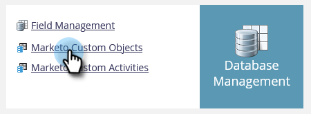

# Metagegevens van aangepast object exporteren {#custom-object-metadata-export}

Als u de SOAP API of de [!DNL Munchkin] API gebruikt, kunt u het schema met aangepaste objectmetagegevens exporteren. Zo krijg je het.

>[!AVAILABILITY]
>
>Niet alle Marketo Engage-gebruikers hebben deze functionaliteit aangeschaft. Neem contact op met het Adobe-accountteam (uw accountmanager) voor meer informatie.

1. Ga naar het **[!UICONTROL Admin]** -gebied.

   

1. Klik op **[!UICONTROL Marketo Custom Objects]**.

   

1. Selecteer het aangepaste Marketo-object dat u wilt exporteren.

   

1. Klik op de vervolgkeuzelijst **[!UICONTROL Custom Object Actions]** en selecteer **[!UICONTROL Export Object]** .

   

>[!NOTE]
>
>Het aangepaste object moet zich in de goedgekeurde status bevinden om te worden geëxporteerd.

U hebt nu een spreadsheet met het Schema van het Voorwerp van de Douane, over drie lusjes.

