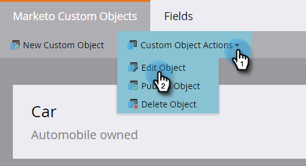

# Een aangepast Marketo-object {#edit-and-delete-a-marketo-custom-object} bewerken en verwijderen

>[!NOTE]
>
>Als het aangepaste object is goedgekeurd, kunt u geen koppelings- of deduplicatieveld maken, bewerken of verwijderen.

## Een aangepast object bewerken {#edit-a-custom-object}

Met het menu Acties voor aangepaste objecten kunt u een aangepast object bewerken of verwijderen.

1. Klik **Admin**, en in **Databasebeheer**, selecteer **Aangepaste objecten van Marketo**.

   

1. Selecteer aan de rechterkant het aangepaste object dat u wilt bewerken.

   

1. Klik op het tabblad **Aangepaste objecthandelingen** en klik op **Object bewerken**.

   

   >[!NOTE]
   >
   >Met Object bewerken worden dezelfde velden weergegeven als met Object maken, behalve de API-naam, die u niet kunt bewerken.

1. Breng de gewenste wijzigingen aan. Sleep de schuifregelaar om het object weer te geven op de pagina Details lead. Klik **Opslaan**.

   

1. Vergeet niet [het bewerkte object](/help/marketo/product-docs/administration/marketo-custom-objects/approve-a-custom-object.md) goed te keuren.

## Een aangepast object {#delete-a-custom-object} verwijderen

Het is gemakkelijk om een douanevoorwerp te schrappen, maar u moet voorzichtig zijn. Aangepaste objecten kunnen worden verbonden met andere objecten of met slimme lijsten. Zo, waarschuwt Marketo u alvorens u **Schrapping** te laten klikken.

>[!CAUTION]
>
>U kunt een aangepast object niet meer herstellen nadat u het hebt verwijderd.

1. Klik **Admin**, en in **Databasebeheer**, selecteer **Aangepaste objecten van Marketo**.

   

1. Selecteer het object dat u wilt verwijderen.

   

1. Klik **Aangepaste objectacties** en selecteer **Object** verwijderen.

   

   >[!TIP]
   >
   >U kunt ook met de rechtermuisknop op het object klikken en Object **Verwijderen** selecteren.

1. Als het aangepaste object een conceptversie heeft en nog niet is goedgekeurd, wordt deze waarschuwing weergegeven. Als u zeker bent, klik **Schrapping**.

   

1. Als het aangepaste object al is goedgekeurd, is er een groter risico als u het verwijdert. Je krijgt een sternerlijke waarschuwing. Voer **Ik begrijp** in, schakel het selectievakje **Kan niet ongedaan maken** in en klik op **Delete**.

   

   >[!NOTE]
   >
   >Als het aangepaste object is gekoppeld aan een intermediair object, moet u eerst het intermediaire object verwijderen.

>[!MORELIKETHIS]
>
>[Een aangepast object goedkeuren](/help/marketo/product-docs/administration/marketo-custom-objects/approve-a-custom-object.md)
