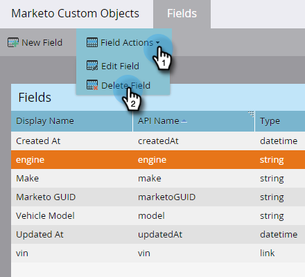

# Aangepaste Marketo-objectvelden bewerken en verwijderen {#edit-and-delete-marketo-custom-object-fields}

## Een veld bewerken {#edit-a-field}

Soms moet u een veld bewerken dat nog niet is goedgekeurd.

1. Klik op een aangepast object en het veld dat u wilt bewerken.

   

1. Klik op het tabblad [!UICONTROL Fields] op **[!UICONTROL Field Actions]** en **[!UICONTROL Edit Field]** .

   

1. Breng de gewenste wijzigingen aan en klik op **[!UICONTROL Save]** .

   

   >[!NOTE]
   >
   >U kunt de API-naam niet bewerken.

1. De wijzigingen worden weergegeven in de lijst van **[!UICONTROL Fields]** .

   

## Een veld verwijderen {#delete-a-field}

Wanneer u geen gebied in een douanevoorwerp meer nodig hebt, kunt u het schrappen.

1. Klik op het tabblad Velden op **[!UICONTROL Field Actions]** en **[!UICONTROL Delete Field]** .

   

1. Zorg ervoor dat u het veld echt wilt verwijderen voordat u de trigger trekt! Klik op **[!UICONTROL Delete]**.

   

Het is weg!

>[!NOTE]
>
>[&#x200B; voeg de Gebieden van de Objecten van Marketo toe &#x200B;](/help/marketo/product-docs/administration/marketo-custom-objects/add-marketo-custom-object-fields.md)
