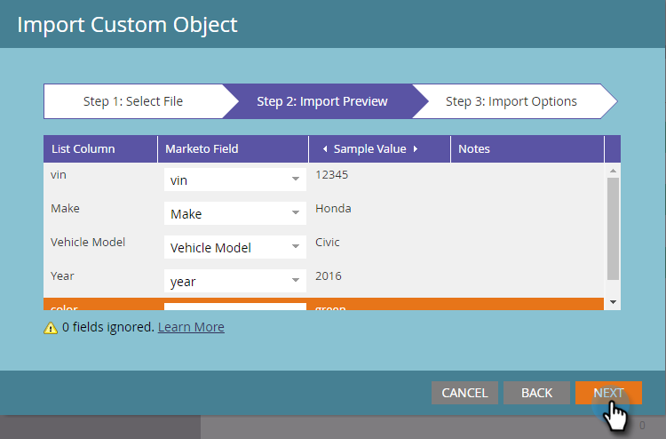

# Aangepaste objectgegevens importeren {#import-custom-object-data}

Het is gemakkelijk om douaneobjecten gegevens in uw gegevensbestand in te voeren. Als u douanevoorwerpen met bedrijven gebruikt, zie [Aangepaste objecten gebruiken met bedrijven](/help/marketo/product-docs/administration/marketo-custom-objects/understanding-marketo-custom-objects.md#using-custom-objects-with-companies) voor meer informatie .

1. Ga in Mijn Marketo naar **[!UICONTROL Database]**.

   

1. Klik op **[!UICONTROL New]** en selecteer **[!UICONTROL Import Custom Object Data]**.

   

1. Klikken **[!UICONTROL Browse]** om het gegevensbestand te zoeken. Selecteer de bestandsindeling (door komma&#39;s gescheiden waarden in dit voorbeeld).

   

1. Selecteer uw [!UICONTROL custom object].

   

1. Selecteer [!UICONTROL Dedupe Mode] in de vervolgkeuzelijst. Klik op **[!UICONTROL Next]**.

   

   >[!NOTE]
   >
   >Gebruik het (de) Dedupeveld(en) als unieke herkenningstekens wanneer u douaneobjecten verslagen creeert of bijwerkt. In dit voorbeeld wordt het veld Dedupe van het dialoogvenster **auto** aangepast object - vin (ID voertuig). Als u alleen aangepaste objectrecords bijwerkt, kunt u de optie [!UICONTROL Marketo Guid] als de [!UICONTROL Dedupe Mode].

1. Wijs elke kolom aan een gebied van Marketo toe, dat het van drop-down selecteert.

   

   >[!NOTE]
   >
   >Zorg ervoor dat de waarden in het bestand overeenkomen met het veldtype waarop u deze aansluit (bijvoorbeeld tekst, geheel getal, enzovoort). Anders wordt het bestand geweigerd.

1. Klik op **[!UICONTROL Next]**.

   

1. Klik op **[!UICONTROL Import]**.

   

   >[!NOTE]
   >
   >De formaatgrens voor douanevoorwerpen is 100MB.

   >[!TIP]
   >
   >Voer uw e-mailadres in het dialoogvenster **[!UICONTROL Send Alert To]** -veld en Marketo sturen je een e-mail wanneer het importeren is voltooid.

1. In de rechterbovenhoek van het scherm ziet u een melding als het importeren wordt uitgevoerd en ziet u de uiteindelijke resultaten als het is voltooid.

   

   Yay!

>[!MORELIKETHIS]
>
>[Aangepaste Marketo-objecten begrijpen](/help/marketo/product-docs/administration/marketo-custom-objects/understanding-marketo-custom-objects.md)
