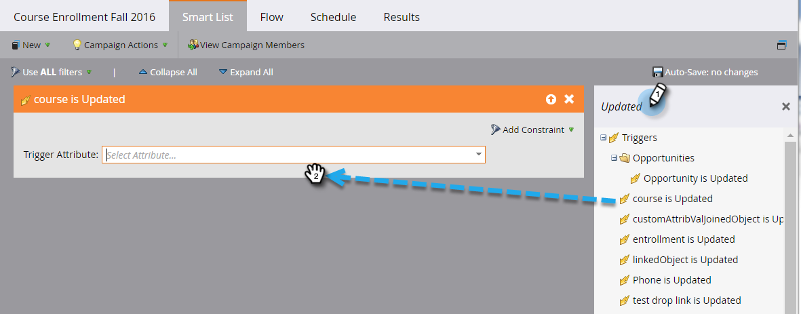

# Aangepaste objectwijzigingen activeren {#trigger-off-custom-object-changes}

>[!NOTE]
>
>Deze functie is alleen beschikbaar:
>
>* Voor klanten op de Orion-infrastructuur
>* Alleen voor gebruik met aangepaste Marketo-objecten, niet met aangepaste objecten die zijn gesynchroniseerd via de integratie met Salesforce of Microsoft Dynamics
>* Als trigger, geen filter

>
>
Neem contact op met [Marketo-ondersteuning](https://nation.marketo.com/t5/Support/ct-p/Support) om Aangepaste objectwijzigingstriggers in te schakelen.

In de slimme lijst van een slimme campagne, kunt u een stroomactie teweegbrengen wanneer een douanevoorwerp aan een persoon of een bedrijf wordt toegevoegd. U kunt ook een slimme lijst maken die een *change* in een aangepast object als trigger gebruikt. U kunt deze bijvoorbeeld gebruiken om een e-mail te verzenden wanneer de naam van een cursus wordt bijgewerkt.

>[!NOTE]
>
>Een item in het activiteitenlogboek wordt niet gemaakt wanneer een record van een aangepast object wordt gewijzigd.

1. Ga in Marketo naar **Marketingactiviteiten.**

   

1. Maak of open een bestaande slimme campagne en selecteer de slimme lijst.

   

1. Zoek de trigger die u nodig hebt en sleep deze naar het canvas.

   

1. Selecteer het triggerkenmerk.

   

1. Stel eventueel een restrictie in.

   

1. En daar ben je. De wijziging wordt automatisch opgeslagen.

   

   >[!NOTE]
   >
   >* [Een slimme lijst maken](/help/marketo/product-docs/core-marketo-concepts/smart-lists-and-static-lists/creating-a-smart-list/create-a-smart-list.md)
   >* [Aangepaste Marketo-objecten begrijpen](/help/marketo/product-docs/administration/marketo-custom-objects/understanding-marketo-custom-objects.md)

