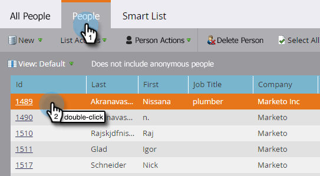

# Aangepaste objecten markeren {#understanding-marketo-custom-objects}

Gebruik aangepaste objecten om metrische gegevens bij te houden die specifiek zijn voor uw bedrijf.

>[!NOTE]
>
>**FYI**
>
>Marketo is nu bezig met het standaardiseren van de taal voor alle abonnementen, dus u ziet mogelijk leads/leads in uw abonnement en personen/personen in docs.marketo.com. Deze termen betekenen hetzelfde. het heeft geen invloed op de instructies van het artikel . Er zijn nog enkele andere veranderingen. [Meer](http://docs.marketo.com/display/DOCS/Updates+to+Marketo+Terminology)informatie.

>[!NOTE]
>
>**Beschikbaarheid**
>
>Niet alle klanten hebben deze functionaliteit aangeschaft. Neem contact op met je verkoper voor meer informatie.

Gebruik aangepaste objecten als filters en triggers in slimme campagnes. Bijvoorbeeld:

* **Filter**: Alleen e-mails sturen naar eigenaars van specifieke voertuigmerken
* **Trigger**: Verzend een e-mail wanneer een douanevoorwerp aan een persoon of een bedrijf wordt toegevoegd.

U kunt aangepaste objecten instellen in een een-op-een-relatie of een veel-op-veel-relatie. Bijvoorbeeld:

* **Een-op-veel**: Eén persoon heeft meerdere auto&#39;s
* **Veel-tot-veel**: Meerdere studenten zijn ingeschreven voor meerdere cursussen in een cursuscatalogus

Een één-op-vele structuur gebruikt één enkel verbindingsgebied om het douanevoorwerp met een persoon of een bedrijf te verbinden.

Vele-aan-vele douanevoorwerpen gebruiken twee verbindingsgebieden, deel van een intermediair voorwerp. Eén koppelingsveld is verbonden met de persoon of het bedrijf en een ander veld is verbonden met het aangepaste object, zoals de cursuscatalogus. Dit tussenliggende object kan aanvullende aangepaste velden bevatten, zoals een cursusniveau of een aanwezigheidsdatum, waarin de aard van de verbinding nader wordt gedefinieerd.

>[!TIP]
>
>Importeer aangepaste objecten met gebruik van door komma&#39;s gescheiden waarden (CSV) in de gebruikersinterface om een gegevensvoorbeeld te testen en te valideren. Vervolgens uploadt u al uw bestanden met een API.

>[!CAUTION]
>
>U kunt aangepaste objecten niet herstellen, dus zorg dat u ze niet meer nodig hebt voordat u ze verwijdert.

## Aangepaste markeringsobjecten openen {#accessing-marketo-custom-objects}

1. Als u aangepaste Marketo-objecten wilt maken of bewerken, klikt u op **Beheer **en vervolgens op de koppeling **Marketo Custom** Objects.

   

1. In de weergave Aangepaste objecten markeren worden alle aangepaste objecten rechts weergegeven, maar alleen de goedgekeurde objecten in het hoofdraster.

   

1. In het raster worden de naam van het object, het aantal records, het aantal velden en de datum van de meest recente update weergegeven.

   >[!TIP]
   >
   >Marketo werkt deze velden automatisch bij, maar u kunt de weergave vernieuwen door op het pictogram in de kolom Records te klikken.

1. Klik op de naam van het object aan de rechterkant om de detailpagina te openen.

   

## Aangepaste objecten weergeven die zijn gekoppeld aan een persoon {#view-custom-objects-associated-to-a-person}

Nadat u de structuur van het douanevoorwerp hebt gecreeerd, wanneer u de specifieke gegevens van het douanevoorwerp uploadt, worden de douanevoorwerpen automatisch geassocieerd aan mensen in het gegevensbestand gebruikend het verbindingsgebied in het douanevoorwerp. U kunt informatie bekijken van het lusje van Objecten van de Douane op de pagina van persoondetails.

1. Ga naar **database**.

   

1. Open uw database en klik op het tabblad **Personen** . Dubbelklik op de record voor een persoon die u aan een aangepast object hebt gekoppeld.

   

1. Klik op het tabblad **Aangepaste objecten** op de pagina met persoonlijke details. Selecteer het object in de vervolgkeuzelijst.

   

1. Nu kunt u een lijst weergeven van alle aangepaste objecten van dat type die aan die persoon zijn gekoppeld.

   

## Aangepaste objecten gebruiken met bedrijven {#using-custom-objects-with-companies}

Een douanevoorwerp dat met het bedrijf verbonden is werkt het best als u bedrijven van CRM synchroniseert of als u uitdrukkelijk bedrijven creeert gebruikend API. Wij adviseren ook dat u identiteitskaart van het Bedrijf als verbindingsgebied gebruikt.

Als u veelvoudige mensen in Marketo hebt die verslagen in CRM of Marketo-slechts verslagen zijn, zal een douanevoorwerp verbonden aan een bedrijf niet verbonden worden met meer dan één individueel verslag. Dit komt omdat een bedrijf met veelvoudige mensen eronder het wordt gesteund slechts wanneer de bedrijven van CRM worden gesynchroniseerd of als u een API gebruikt om bedrijven uitdrukkelijk tot stand te brengen.

Aangepaste objecten kunnen alleen rechtstreeks aan één record worden gekoppeld. Dit betekent dat wanneer uw type van douaneobjecten door bedrijfgebied wordt verbonden, u zou moeten ervoor zorgen dat uw persoonverslagen aan een bedrijf of gebruikend contactomzetting in uw CRM, of gebruikend het externalCompanyId gebied worden geassocieerd, als u bedrijven beheert die REST APIs van Marketo gebruiken. Voor persoonrecords die niet expliciet aan bedrijfsrecords zijn gekoppeld, worden aangepaste objecten die met bedrijf zijn gekoppeld, willekeurig gekoppeld aan één record, zelfs als de waarde van het bedrijfsveld door veel personen wordt gedeeld.

Zie Aangepaste objectgegevens  importeren voor meer informatie.

>[!NOTE]
>
>**Verwante artikelen**
>
>* [Aangepaste objecten markeren](create-marketo-custom-objects.md)
>* [Een aangepast object goedkeuren](approve-a-custom-object.md)
>* [Een aangepast markeerobject bewerken en verwijderen](edit-and-delete-a-marketo-custom-object.md)
>* [Markeren toevoegen aan aangepaste objectvelden](add-marketo-custom-object-fields.md)
>* [Markeren naar aangepaste objectvelden bewerken en verwijderen](edit-and-delete-marketo-custom-object-fields.md)
>* [Aangepaste objectgegevens importeren](import-custom-object-data.md)

>

