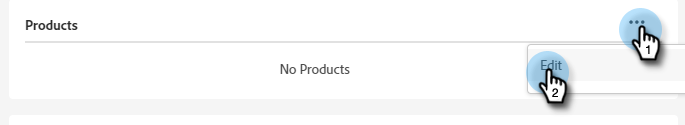
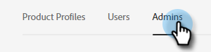

# Een productbeheerder toevoegen of verwijderen {#add-or-remove-a-product-admin}

>[!NOTE]
>
>**Admins van het 0&rbrace; Systeem &lbrace;wordt slechts gecreeerd op het niveau van Adobe Org.** Als u denkt u meer dan één nodig hebt, gelieve [&#x200B; de Steun van Marketo &#x200B;](https://nation.marketo.com/t5/support/ct-p/Support) te contacteren.

## Een productbeheerder toevoegen {#add-a-product-admin}

>[!IMPORTANT]
>
>Er moet een beheerder aan een productprofiel worden toegevoegd om toegang tot Marketo Engage te krijgen.

1. Login aan [&#x200B; Adobe Admin Console &#x200B;](https://adminconsole.adobe.com/){target="_blank"}.

   

1. Klik **Marketo Engage**.

   

1. Selecteer het gewenste abonnement (als u meerdere abonnementen hebt).

   

1. Klik op de tab **[!UICONTROL Admins]** .

   

1. Klik op **[!UICONTROL Add Admin]** .

   

1. Voer het e-mailadres of de gebruikersnaam in van de beheerder die u wilt toevoegen. Voornaam en achternaam zijn optioneel. Klik op **[!UICONTROL Save]**.

   

1. Klik op de naam van de beheerder die u zojuist hebt toegevoegd.

   

1. Klik onder Producten op het menu met drie punten en selecteer **[!UICONTROL Edit]** .

   

1. Klik op het **+** -teken. Klik op het chevron naast het gewenste Marketo Engage-abonnement (als er meerdere zijn) en selecteer het gewenste productprofiel.

   

1. Klik op **[!UICONTROL Save]**.

   

De gebruiker ontvangt dan twee e-mails. In de eerste e-mail worden ze op de hoogte gebracht van het feit dat aan hen rechten voor productbeheer zijn toegekend aan Marketo Engage. In de tweede e-mail worden ze uitgenodigd zich aan te melden bij Marketo Engage.

>[!NOTE]
>
>Wanneer de gebruiker van productbeheer via de Adobe Admin Console aan Marketo Engage wordt toegevoegd, krijgt de gebruiker de rol van Adobe-productbeheerder binnen het abonnement.

## Admin verwijderen {#remove-a-user}

1. Login aan [&#x200B; Adobe Admin Console &#x200B;](https://adminconsole.adobe.com/){target="_blank"}.

   

1. Klik **Marketo Engage**.

   

1. Selecteer het gewenste abonnement (als u meerdere abonnementen hebt).

   

1. Klik op de tab **[!UICONTROL Admins]** .

   

1. Selecteer de beheerder die u wilt verwijderen en klik op de knop **[!UICONTROL Remove Admin]** .

   

1. Klik op **[!UICONTROL Remove Admin]** om te bevestigen.

   

De gebruiker ontvangt vervolgens een e-mail met de kennisgeving dat hij of zij geen toegang meer heeft tot Marketo Engage voor productbeheer.
